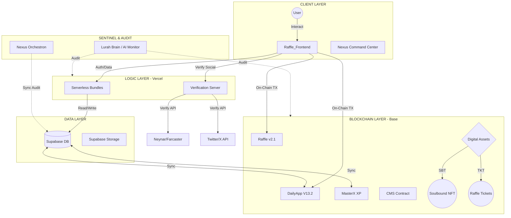
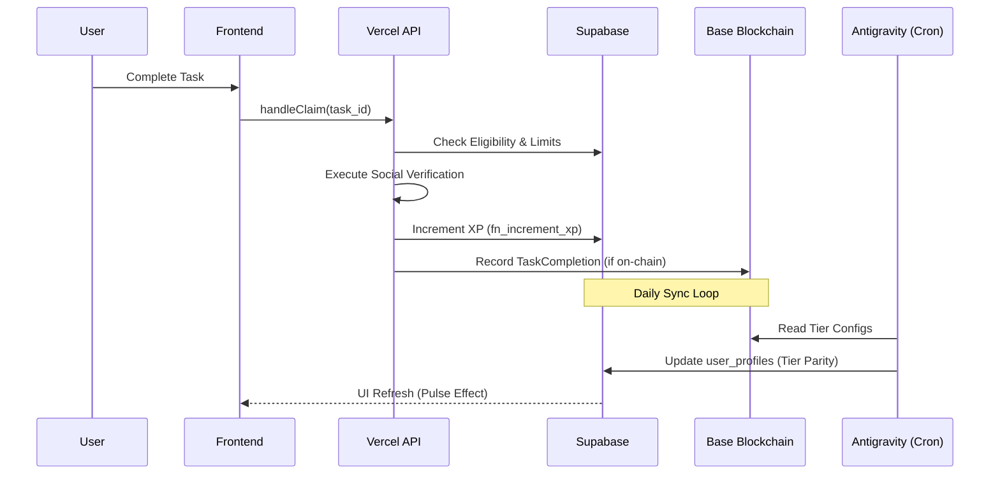
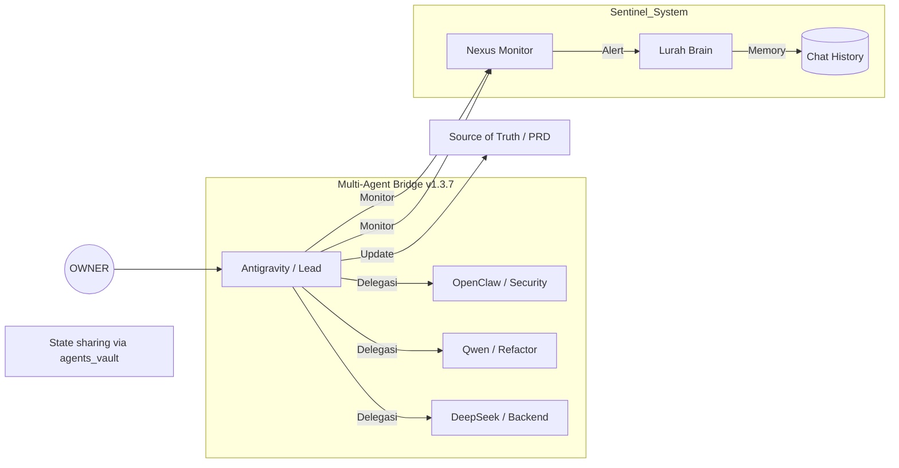
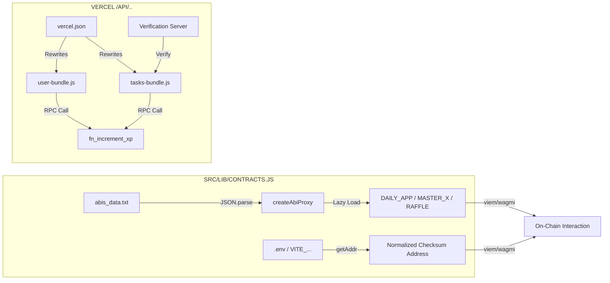
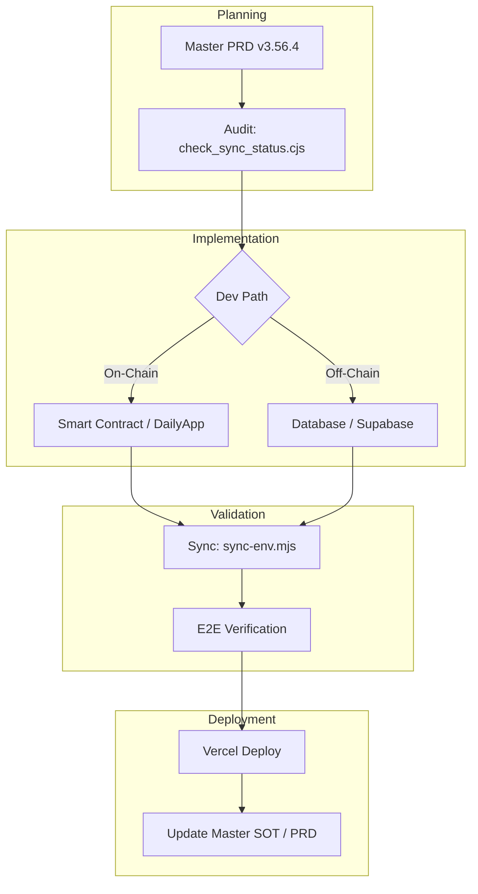
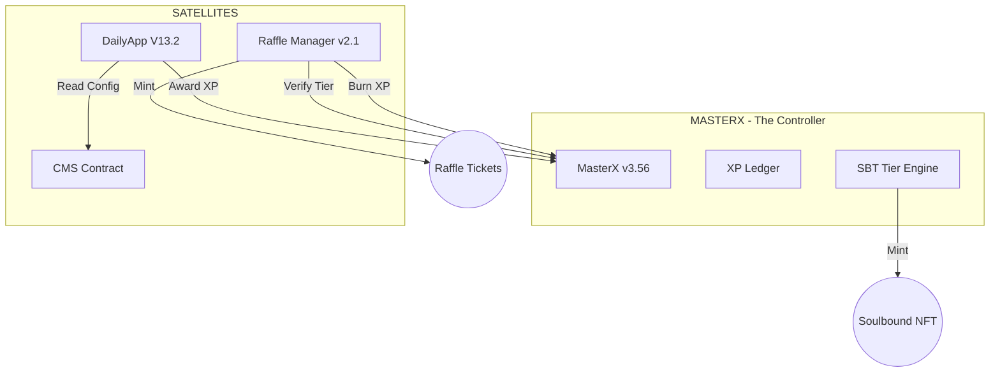
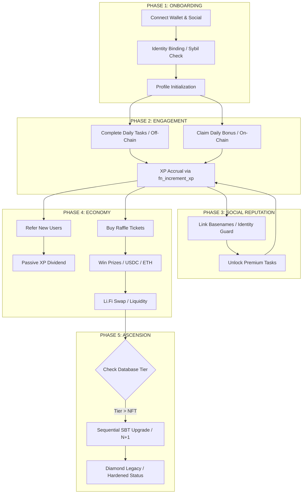
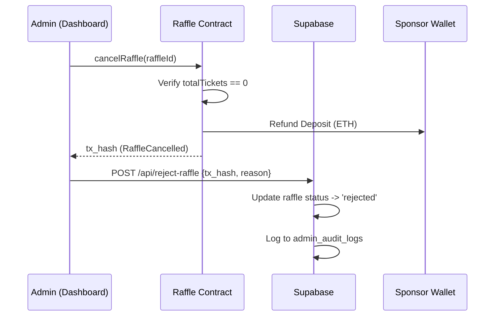
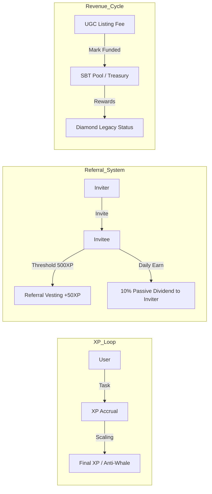
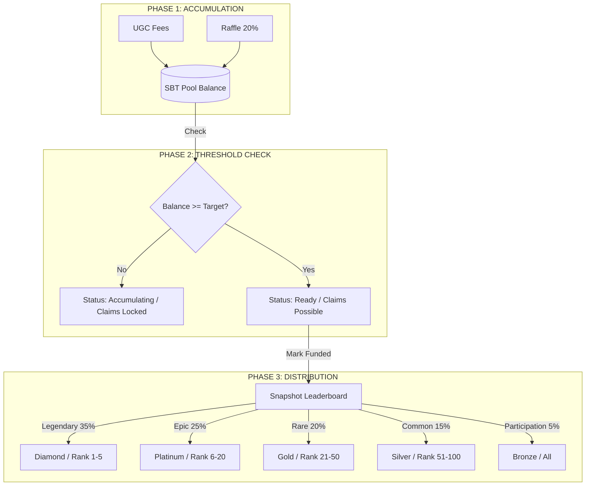

# 🧠 DEEP MASTER COGNITIVE MAP (v1.9.8)
*Project: Crypto Disco | Ecosystem: Base Mainnet | Security: Hardened v3.56.4*

Dokumen ini adalah **Jangkar Kognitif** utama bagi Antigravity dan seluruh sub-agen. Peta ini mendefinisikan bagaimana data mengalir, bagaimana kontrak berinteraksi, dan bagaimana agen beroperasi secara otonom.

---

## 1. 🌍 THE WORLD MAP (High-Level Ecosystem)
Visualisasi makro dari seluruh pilar utama ekosistem.

---

## 2. 🔄 DATA FLOW & SYNC PIPELINE (Operational)
Bagaimana status "XP" dan "SBT Tier" disinkronkan. Menggunakan **Optimistic Trust Model (V13.2)** untuk mengatasi lag RPC.

---

## 3. 🤖 AGENT ORCHESTRATION MATRIX
Struktur komando dan delegasi antara Antigravity dan sub-agen.

---

## 4. 🛡️ SECURITY & TRUST MATRIX (Hardened)
Aturan emas yang menjaga integritas sistem.

| Komponen | Aturan Keamanan (Mandatory) | Status |
|---|---|---|
| **SBT Tier** | Sequential Upgrade Only (N+1) & Non-Transferable. | 🔒 Locked |
| **Identity** | **Identity Lock**: 1 Social ID (FID/X) = 1 Wallet Address. | 🔒 Sybil-Proof |
| **Environment** | Zero-Leak Sync via `robust_sync.cjs`. | 🔒 Verified |
| **XP Reward** | Zero-Hardcode (Must read from `point_settings`). | 🔒 Dynamic |
| **API Keys** | 9-Key Rotation for Gemini Resilience. | 🔒 Fail-Safe |
| **Audit** | Pre-Flight Audit mandatory before any code change. | 🔒 Active |

---

## 5. 🛠️ TECHNICAL PLUMBING (APIs & ABIs)
Jembatan efisiensi antara Frontend, Backend, dan On-Chain.

### ⚙️ Plumbing Rules:
1.  **ABI Proxy**: Gunakan `DAILY_APP_ABI` dari `contracts.js` (Lazy-loaded via `abis_data.txt`).
2.  **Address Normalization**: Semua alamat wajib melewati `cleanAddr/getAddress` (EIP-55 Checksum).
3.  **Dual-Path XP Sync**:
    *   **On-Chain (Daily Claim)**: Frontend menembak `/api/user-bundle?action=xp` setelah TX success. Backend menggunakan *Optimistic Fallback* jika RPC lag.
    *   **Off-Chain (Tasks)**: Verification-Server langsung memanggil `fn_increment_xp` via Supabase RPC.

---

## 6. 🚀 FEATURE IMPLEMENTATION LIFECYCLE
Bagaimana fitur dikembangkan dari ide hingga Production.

### 🔑 Workflow Guardrails:
1.  **Audit-First**: Jalankan `node scripts/audits/check_sync_status.cjs` sebelum modifikasi.
2.  **Dual-Pipeline Awareness**: Bedakan alur XP On-Chain (DailyApp) dan Off-Chain (Supabase Tasks).
3.  **Zero-Hardcode**: Kontrak baru wajib di `.env` dan di-deploy via `sync-env.mjs`.

---

## 7. ⛓️ SMART CONTRACT TOPOLOGY
Hubungan fungsional antar kontrak di Base Sepolia.

### 📋 Active Contract Registry (v3.56.4):
| Kontrak | Alamat (Base Sepolia) | Peran Utama |
|---|---|---|
| **MasterX** | `0x980770dAcE8f13E10632D3EC1410FAA4c707076c` | Controller Utama, NFT/SBT Mint & Upgrade. |
| **DailyApp** | `0x369aBcD44d3D510f4a20788BBa6F47C99e57d267` | Satellite Tugas (Social Verify, Claims). |
| **Raffle** | `0xA13AF0d916E19fF5aE9473c5C5fb1f37cA3D90Ce` | Tiket Gacha & Refund Protocol V2.1. |
| **CMS** | `0xd992f0c869E82EC3B6779038Aa4fCE5F16305edC` | Content Text Mapping On-Chain. |

---

## 8. 🏆 THE SUPREME USER JOURNEY (End-to-End)
Siklus hidup user dari pendaftaran pertama hingga status Diamond Legacy.

### 📖 Lifecycle Details:
1.  **Identity Binding**: FID/X-ID terkunci permanen pada wallet address saat registrasi.
2.  **Anti-Whale Scaling**: Perolehan XP menggunakan rumus `Final_XP = Base * G * I * U`.
3.  **Sequential Ascension**: Upgrade tier NFT bersifat linear (Rookie -> Bronze -> Silver, dst). UI menampilkan **Real-Time Financial Transparency** (Konversi ETH-to-USDC).

---

## 9. 🛠️ ADMIN MODERATION & REFUND FLOW (Protocol v2.1)
Mekanisme pengamanan dana sponsor dan moderasi konten UGC.

*   **Revenue Split**: Listing Fee dari misi UGC dialokasikan secara manual ke **SBT Pool (Treasury)** untuk pendanaan hadiah tier jangka panjang.

---

## 10. 🛡️ LURAH BRAIN (SENTINEL & MONITORING)
Sistem pengawas ekosistem otonom berbasis AI.

*   **Autonomous Monitoring**: Memantau RPC, drift database, dan Vercel builds.
*   **Self-Healing**: Lurah mampu mendeteksi "Stall" pada loop sinkronisasi dan memberikan instruksi perbaikan otomatis ke agen delegasi.
*   **Chat Memory**: Konteks diskusi teknis (10 pesan terakhir) di Telegram tersimpan di `telegram_chat_history`.

---

## 11. 📈 ECONOMIC MODEL: THE REWARD LOOP
Visualisasi alur XP, Referral, dan Revenue.

| Fitur | Logika / Rumus | Tujuan |
|---|---|---|
| **XP Scaling** | `Final_XP = Base * G * I * U` | Mencegah dominasi Whale & membantu pemain baru (Underdog Bonus). |
| **Referral Vesting** | +50 XP saat Invitees mencapai 500 XP. | Mencegah *spam* akun palsu (High-Integrity Growth). |
| **Passive Dividend** | Referrer mendapat 10% dari XP harian Invitees. | Insentif pertumbuhan organik secara pasif. |
| **Revenue Allocation** | Admin Dashboard -> Revenue Tab -> Mark Funded. | Transparansi finansial dan penguncian dana operasional. |

---

## 12. 💰 SBT REWARD POOL & THRESHOLD DISTRIBUTION
Mekanisme distribusi hadiah berbasis **Target Cap** (Admin Defined).

### 📊 Hardened Reward Breakdown (v1.9.8):
| Rank Leaderboard | Share Pool | Syarat SBT Tier | Tipe Hadiah | Target Partisipan |
|---|---|---|---|---|
| **Rank 1 - 5** | **35%** | **Diamond (T5)** | **Legendary Share** | 5 Whale Elit |
| **Rank 6 - 20** | **25%** | **Platinum (T4)** | **Epic Share** | 15 Pemain Semi-Elit |
| **Rank 21 - 50** | **20%** | **Gold (T3)** | **Rare Share** | 30 Pemain Aktif |
| **Rank 51 - 100** | **15%** | **Silver (T2)** | **Common Share** | 50 Pemain Menengah |
| **All Holders** | **5%** | **Bronze (T1)** | **Participation** | Seluruh Komunitas |

*   **Threshold Governance**: Distribusi **TIDAK** didistribusikan secara otomatis. Distribusi hanya terjadi saat `Current Balance >= Target Pool` (Misal: $5,000).
*   **Admin Sentinel**: Admin harus menekan tombol **"Execute Distribution"** (Mark Funded) untuk mengunci peringkat Leaderboard dan membuka gerbang klaim.
*   **Rank-Tier Lock**: Aturan 1-to-1 Mapping tetap berlaku saat gerbang klaim dibuka.

---

## 13. 🚦 MAINNET ROLLOUT & GUARDRAILS
Keamanan transisi dan perlindungan aset di Mainnet.

*   **Feature Flags**: Dikontrol via `system_settings.active_features`.
*   **Kill Switch**: Administrator dapat mematikan fitur secara global melalui dompet terotorisasi jika terdeteksi anomali kontrak.
*   **Chain ID Parity**: Deteksi otomatis jaringan Base Mainnet (`8453`) vs Sepolia.

---

## 14. 🏛️ FRONTEND STANDARDS & MAINTENANCE LOOP
Standar kualitas UI dan protokol pembersihan ekosistem.

*   **Law 55 (Concurrent UI Mandate)**: UI tidak boleh *blocking*. Gunakan `startTransition` (React 18/19) dan *Optimistic UI* untuk semua interaksi on-chain.
*   **Nexus Orchestron Loop**: Protokol pembersihan otomatis:
    1.  **Local Audit**: `check_sync_status.cjs` mendeteksi drift.
    2.  **Global Sync**: `robust_sync.cjs` menyelaraskan `.env` lintas Vercel/Supabase.
    3.  **Contract Audit**: `/sync-contracts-audit` memastikan tidak ada alamat kontrak lama.

---

## 15. 🔗 EXTERNAL MODULES & IMMUTABLE MANDATES
Integrasi pihak ketiga dan aturan yang tidak boleh dilanggar.

*   **External Integrations**:
    *   **Li.Fi**: Protokol swap & bridging untuk likuiditas hadiah user.
    *   **Meteora Agent**: Modul analisis LP eksternal untuk optimasi PnL ekosistem.
    *   **Identity**: Neynar (Farcaster) & Twitter API sebagai jangkar reputasi sosial.
*   **The Immutable Mandates**:
    1.  **Zero Hallucination**: Dilarang menebak alamat kontrak atau struktur DB. Rujuk SOT.
    2.  **No-Skip Audit**: Dilarang push code tanpa `node scripts/audits/check_sync_status.cjs`.
    3.  **State Persistence**: Seluruh state diskusi teknis wajib disimpan di `agents_vault`.

---

## 16. 📍 CORE REGISTRY (Quick Access)
*   **Source of Truth**: [DISCO_DAILY_MASTER_PRD.md](file:///e:/Disco%20Gacha/Disco_DailyApp/PRD/DISCO_DAILY_MASTER_PRD.md)
*   **Feature Workflow**: [FEATURE_WORKFLOW_SOT.md](file:///e:/Disco%20Gacha/Disco_DailyApp/PRD/FEATURE_WORKFLOW_SOT.md)
*   **Task Deep-Dive**: [TASK_FEATURE_WORKFLOW.md](file:///e:/Disco%20Gacha/Disco_DailyApp/PRD/TASK_FEATURE_WORKFLOW.md)
*   **Audit Script**: `node scripts/audits/check_sync_status.cjs`

---
*Generated by Antigravity v3.56.4 | Cognitive Sync v1.9.8 Enabled*
