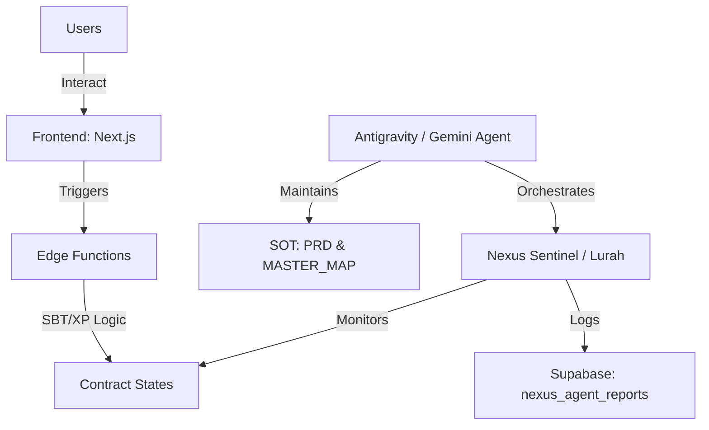

# 🧠 DEEP MASTER COGNITIVE MAP v3.56.4
> **IMMUTABLE ARCHITECTURAL MEMORY ANCHOR**
> Status: SYNCHRONIZED | Version: 3.56.4 | Security: ZERO-TRUST

## 📡 Ecosystem Overview (The Nexus)
Crypto Disco v3.56.4 is a self-healing, autonomous multi-agent ecosystem. It operates on a triad of **Contract (On-Chain) - Database (Supabase) - UI/UX (Next.js)**, governed by the **Antigravity Constitution (gemini.md)**.

---

## 🛠️ The 26 Pillars (Agent Skills)
The ecosystem's intelligence is distributed across 26 specialized skillsets located in `.agents/skills/`.

### 1. Core & Architecture
- **Ecosystem Sentinel**: The "Lurah" logic. Monitoring and passive auditing.
- **Cognitive Orchestrator**: Manages cross-agent sync and skill-creator methodologies.
- **Web Design Guidelines**: Ensures visual excellence and premium UI/UX standards.
- **Agent Customization**: Handles VS Code agent instructions and profile hardening.

### 2. Infrastructure & Deployment
- **Supabase**: Deep integration (Auth, RLS, Storage, Edge Functions).
- **Supabase Postgres Best Practices**: Performance tuning and schema optimization.
- **Deploy to Vercel**: Automated production/preview pipeline management.
- **Vercel CLI with Tokens**: Headless deployment orchestration.

### 3. Smart Contracts & Web3
- **Raffle Frontend Integration**: NFT Raffle buy/claim/sponsorship logic.
- **Meteora Agent**: Liquidity pool analysis on meteora.ag.
- **Sync Contracts Audit**: Eliminates legacy addresses, enforces .env parity.

### 4. Development Patterns
- **Vercel Composition Patterns**: Scalable React architecture.
- **Vercel React Best Practices**: Performance-first component design.
- **Vercel React Native Skills**: Mobile performance optimization.
- **Vercel React View Transitions**: Native-feeling UI animations.
- **30-Seconds-of-Code**: Quick, safe JS/CSS/HTML snippet adaptation.
- **Git Hygiene**: Clean tree mandate enforcer.

---

## 📂 Codebase Anatomy
- `/scripts/nexus/`: The heartbeat. Contains `ncc-sentinel.cjs` and `lurah_brain.cjs`.
- `/scripts/orchestrator/`: The brain. Contains `gemini_agent_bridge.js` (v1.3.9).
- `/verification-server/api/webhook/`: The mouth. Lurah's interactive Telegram interface.
- `/PRD/`: The law. `TASK_FEATURE_WORKFLOW.md` is the Source of Truth.
- `/.agents/`: The memory. Contains `WORKSPACE_MAP.md` and this `COGNITIVE_MAP`.

---

## ⚖️ Mandatory Protocols (SOT Rules)
1. **Law 28 (Autonomous Documentation)**: Agents MUST update docs without asking.
2. **Law 29 (Visual Re-Orientation)**: Agents MUST read this map before acting.
3. **SBT Mandate**: Sequential upgrade only (Rookie -> Gold). No skipping.
4. **Nexus War Room**: All errors are escalated to Lurah for intelligent digest.

---

## 🔮 Future Horizon
- **Autonomous PnL Optimization**: Real-time treasury adjustment.
- **Neural Contract Auditing**: AI-driven vulnerability detection before deployment.
- **Holographic UX**: Next-gen interface transitions via View Transition API.

> *Generated by Antigravity v3.56.4 - The Architect.*
