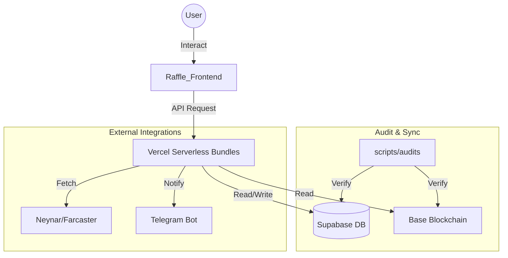

# 🗺️ CRYPTO DISCO LAB - WORKSPACE MAP (v3.57.0)
Last Update: 2026-05-05 (23:55)
Current Architecture: Hybrid Vercel-Supabase-Hardhat (Multi-Agent Optimized)
Status: [🟢] OPERATIONAL - BRIDGE v1.3.7 ACTIVE

Dokumen ini adalah referensi utama untuk navigasi folder dan struktur data di seluruh ekosistem. **Agent dilarang menebak lokasi file; gunakan map ini.**

---

## 1. Directory Tree & Purpose

```text
e:\Disco Gacha\Disco_DailyApp
├── .agents/                 # 🧠 Intelligence & Protocols (The "Brain")
│   ├── skills/              # Agent skillsets (SKILL.md)
│   │   ├── 30-seconds-of-code        # JS/CSS/HTML utilities
│   │   ├── admin-stability           # Admin dashboard reliability
│   │   ├── agent-customization       # Agent personalization protocols
│   │   ├── ai-evolution-pnl-optimizer # 🧠 AI Yield & Profit Logic
│   │   ├── cognitive-orchestrator     # 🧠 Multi-Agent Cognitive Sync (v1.0)
│   │   ├── deepseek-specialist       # High-logic & Security (v3.56.3)
│   │   ├── deploy-to-vercel          # CI/CD deployment workflows
│   │   ├── design-protocol           # UI/UX "Midnight Cyber" standards
│   │   ├── economy-profitability-manager # PnL & Zero-Riba Logic
│   │   ├── ecosystem-sentinel        # Audit & Nexus Orchestration
│   │   ├── git-hygiene               # Clean Git Tree Mandate
│   │   ├── lurah-orchestron          # Passive ecosystem monitoring (Vercel Cron)
│   │   ├── meteora-agent             # Meteora LP analysis workflow
│   │   ├── openclaw-specialist       # Security & Architecture Review
│   │   ├── qwen-specialist           # Local Refactoring & Build Check
│   │   ├── raffle-integration        # NFT Raffle frontend logic
│   │   ├── secure-infrastructure-manager # Security & Contract Lifecycle
│   │   ├── supabase                  # DB & Auth integration
│   │   ├── supabase-audit            # Deep DB security checks
│   │   ├── supabase-postgres-best-practices # DB Performance
│   │   ├── vercel-cli-with-tokens    # Vercel environment sync
│   │   ├── vercel-composition-patterns # React Scalability
│   │   ├── vercel-react-best-practices # Performance optimization
│   │   ├── vercel-react-native-skills # Mobile app standards
│   │   ├── vercel-react-view-transitions # Smooth UI animations
│   │   ├── web-design-guidelines     # UI/UX Accessibility
│   │   └── xp-reward-lifecycle       # XP Accrual & Sync logic
│   ├── workflows/           # Automated workflow definitions (.md)
│   ├── gemini.md            # operational constitution for Gemini
│   ├── VERCEL_ECOSYSTEM_SOT.md # Vercel UI & CLI standards
│   └── WORKSPACE_MAP.md     # This file (Canonical Nav)
│
├── Raffle_Frontend/         # 💻 Main Web Application (Vite + React)
│   ├── api/                 # Serverless Backend Bundles (Vercel)
│   ├── src/                 # Frontend Source
│   │   ├── components/      # Modular UI Components
│   │   │   ├── UGCCampaignCard.jsx # 🆕 Multi-Action Campaign UI
│   │   │   └── SwapModal.jsx # Disco Quick Swap UI (SDK-First)
│   │   ├── hooks/           # Business Logic & State Hooks
│   │   ├── lib/             # Core Configs (Supabase, Contracts)
│   │   ├── pages/           # Route-level Page Components
│   │   └── services/        # External API Integrations
│   └── vercel.json          # API Routing & Security Headers
│
├── scripts/                 # 🛠️ System Automation & Audits
│   ├── audits/              # CRITICAL: Verification & Health Checks
│   │   ├── check_sync_status.cjs # Most important health script
│   │   └── verify-db-sync.cjs   # Database sync verification
│   ├── sync/                # Data & Contract synchronization
│   │   ├── robust_sync.cjs      # Clean-Pipe Sync Engine (v3.43.0)
│   │   └── sync_vercel_all.cjs  # Multi-Project Sync Trigger
│   ├── deployments/         # CI/CD and deploy helpers
│   └── database/            # DB Schema & Dump tools
│
├── verification-server/     # 🤖 Telegram Bot & Off-chain verification
│   ├── api/webhook/         # Bot webhooks
│   └── routes/              # Express-style routes
│
├── DailyApp.V.12/           # 📜 Smart Contracts (Hardhat - Architecture V12/V13)
│   └── contracts/           # Solidity source code (DailyAppV13, MasterX, Raffle)
│
└── PRD/                     # 📄 Product Requirements Documentation
    ├── DISCO_DAILY_MASTER_PRD.md   # Source of Truth
    ├── FEATURE_WORKFLOW_SOT.md     # Feature Workflow & Sync SOT
    ├── TASK_FEATURE_WORKFLOW.md    # 🎯 Task Feature E2E Workflow (Complete SOT)
    └── DISCO_DAILY_MASTER_PRD.html # Viewable Design Doc
```

---

## 2. API Bundle & Routing Map

Seluruh API dikonsolidasi ke dalam bundles untuk menghemat limit Vercel (Max 12).

| Source Route | Bundle Target | Action Key | Purpose |
|--------------|---------------|------------|---------|
| `/api/user/*` | `user-bundle.js` | `sync`, `xp`, `update-profile` | User identity, XP sync & **UGC Reward Sync (v3.38.4)** |
| `/api/leaderboard` | `user-bundle.js` | `leaderboard` | Global rankings |
| `/api/tasks/*` | `tasks-bundle.js` | `social-verify`, `claim` | Task verification & rewards |
| `/api/admin/*` | `admin-bundle.js` | `task-add`, `system-update` | Administrative controls |
| `/api/raffle/*`| `raffle-bundle.js` | `buy`, `create` | NFT Raffle operations |
| `/api/rpc`     | `audit-bundle.js`  | `rpc` | On-chain hex simulation |

---

## 3. Database Schema (Supabase)

| Table/View | Purpose | Key Columns |
|------------|---------|-------------|
| `user_profiles` | Core User Identity | `wallet_address`, `total_xp`, `tier`, `referred_by`, `is_base_social_verified`, `last_seen_at` |
| `user_activity_logs` | Audit Trail (History) | `category`, `activity_type`, `description`, `tx_hash` |
| `point_settings` | Zero-Hardcode Rewards | `activity_key`, `points_value` |
| `system_settings` | Global System Params | `key`, `value` |
| `v_user_full_profile` | Unified Profile View | Joining profiles with Tier names, SBT stats, and Raffle stats |
| `daily_tasks` | Off-Chain Tasks (Supabase) | `platform`, `action_type`, `xp_reward`, `task_type`, `is_base_social_required` |
| `telegram_chat_history` | Conversational Memory (v3.56.4) | `chat_id`, `role`, `content`, `created_at` |

**Key `point_settings` Keys** (pattern: `{platform}_{action_type}`):
`daily_claim`, `farcaster_follow`, `x_follow`, `x_repost`, `x_like`, `base_transaction`, `raffle_buy`, `sponsor_task`

**DB Functions (WAJIB digunakan, jangan bypass):**

| Function | Signature | Tujuan |
|----------|-----------|--------|
| `fn_increment_xp` | `(p_wallet TEXT, p_amount INT)` | Atomically increment `user_profiles.total_xp` — dipakai `tasks-bundle.js` setelah off-chain task claim |
| `fn_increment_raffle_tickets` | `(p_wallet TEXT, p_amount INT)` | Increment tiket raffle user |
| `fn_award_referral_bonus` | trigger `trg_referral_bonus` | Auto-award XP ke referrer saat user baru bergabung |

---

## 4. E2E Workflow Diagram (Ecosystem)



---

## 5. Agent Navigation Rules

1.  **Always refer to `scripts/audits/check_sync_status.cjs`** for current system health.
2.  **Every UI change** must happen in `Raffle_Frontend/src/components` or `pages`.
3.  **Every API change** must respect the existing bundle structure in `Raffle_Frontend/api/`.
4.  **No local script execution** without checking `scripts/` subfolders first to avoid duplication.

---

## 6. Contract & Governance Registry (v3.46.0)

| Contract | Base Mainnet (8453) | Base Sepolia (84532) | Governance |
|----------|---------------------|----------------------|------------|
| **MasterX** | `[RESERVED]` | `0x980770dAcE8f13E10632D3EC1410FAA4c707076c` | `Ownable` ✅ |
| **Raffle** | `[RESERVED]` | `0xA13AF0d916E19fF5aE9473c5C5fb1f37cA3D90Ce` | `Ownable` ✅ |
| **DailyApp** | `[RESERVED]` | `0x369aBcD44d3D510f4a20788BBa6F47C99e57d267` | `AccessControl` ✅ |
| **CMS V2** | `[RESERVED]` | `0xd992f0c869E82EC3B6779038Aa4fCE5F16305edC` | `AccessControl` ✅ |

**Active Admin Wallet**: `0x52260C30697674A7C837feb2Af21BbF3606795C8`

## 7. Mandatory Agent Reading Protocol

Saat perintah **"re-read skills"** diberikan, agent WAJIB membaca file berikut secara berurutan:

1. `.cursorrules` — Master Architect Protocol
2. `.agents/skills/ecosystem-sentinel/SKILL.md` — Audit & Orchestration
3. `.agents/skills/git-hygiene/SKILL.md` — Clean Git Mandate
4. `.agents/skills/raffle-integration/SKILL.md` — Raffle Standards
5. `.agents/WORKSPACE_MAP.md` — Navigation Map (this file)
6. `PRD/TASK_FEATURE_WORKFLOW.md` — 🎯 **Task Feature E2E Workflow (MANDATORY)**
7. `.agents/skills/agent-customization/SKILL.md` — Agent Personalization
8. `.agents/skills/30-seconds-of-code/SKILL.md` — JS/CSS Utilities
9. `PRD/FEATURE_WORKFLOW_SOT.md` — Feature Workflow SOT
10. `.agents/VERCEL_ECOSYSTEM_SOT.md` — 🌐 Vercel Deploy & UI Guidelines
11. `PRD/DISCO_DAILY_MASTER_PRD.md` — Master PRD
12. `.agents/skills/meteora-agent/SKILL.md` — Meteora Data Protocol
13. `.agents/WORKSPACE_MAP.md` — Navigation Map (this file)
14. `.agents/gemini.md` — Operational Constitution
15. `.cursorrules` — Master Architect Protocol

---
*Last Updated: 2026-05-03T21:15:00+07:00 | Multi-Agent Bridge v1.3.8 & 27 Skills Synced. v3.56.7 LOCKED.*
