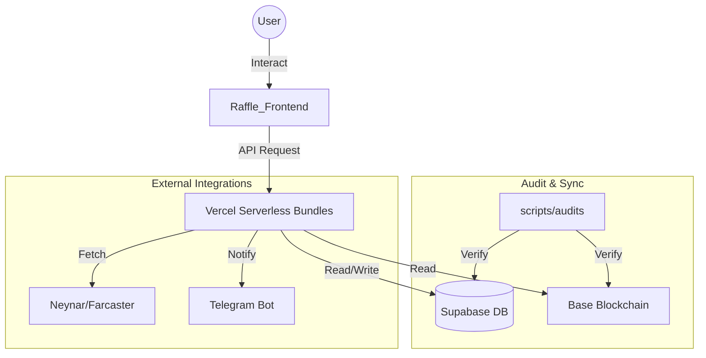

# 🗺️ CRYPTO DISCO — CANONICAL WORKSPACE MAP (v3.38.9)

Dokumen ini adalah referensi utama untuk navigasi folder dan struktur data di seluruh ekosistem. **Agent dilarang menebak lokasi file; gunakan map ini.**

---

## 1. Directory Tree & Purpose

```text
e:\Disco Gacha\Disco_DailyApp
├── .agents/                 # 🧠 Intelligence & Protocols (The "Brain")
│   ├── skills/              # Agent skillsets (SKILL.md)
│   ├── workflows/           # Automated workflow definitions (.md)
│   ├── gemini.md            # operational constitution for Gemini
│   └── WORKSPACE_MAP.md     # This file (Canonical Nav)
│
├── Raffle_Frontend/         # 💻 Main Web Application (Vite + React)
│   ├── api/                 # Serverless Backend Bundles (Vercel)
│   ├── src/                 # Frontend Source
│   │   ├── components/      # Modular UI Components
│   │   ├── hooks/           # Business Logic & State Hooks
│   │   ├── lib/             # Core Configs (Supabase, Contracts)
│   │   ├── pages/           # Route-level Page Components
│   │   └── services/        # External API Integrations
│   └── vercel.json          # API Routing & Security Headers
│
├── scripts/                 # 🛠️ System Automation & Audits
│   ├── audits/              # CRITICAL: Verification & Health Checks
│   │   └── check_sync_status.cjs # Most important health script
│   ├── sync/                # Data & Contract synchronization
│   ├── deployments/         # CI/CD and deploy helpers
│   └── database/            # DB Schema & Dump tools
│
├── verification-server/     # 🤖 Telegram Bot & Off-chain verification
│   ├── api/webhook/         # Bot webhooks
│   └── routes/              # Express-style routes
│
├── DailyApp.V.12/           # 📜 Smart Contracts (Hardhat - Architecture V12/V13)
│   └── contracts/           # Solidity source code (DailyAppV13, MasterX, Raffle)
│
└── PRD/                     # 📄 Product Requirements Documentation
    ├── DISCO_DAILY_MASTER_PRD.md   # Source of Truth
    └── DISCO_DAILY_MASTER_PRD.html # Viewable Design Doc
```

---

## 2. API Bundle & Routing Map

Seluruh API dikonsolidasi ke dalam bundles untuk menghemat limit Vercel (Max 12).

| Source Route | Bundle Target | Action Key | Purpose |
|--------------|---------------|------------|---------|
| `/api/user/*` | `user-bundle.js` | `sync`, `xp`, `update-profile` | User identity, XP sync & **UGC Reward Sync (v3.38.4)** |
| `/api/leaderboard` | `user-bundle.js` | `leaderboard` | Global rankings |
| `/api/tasks/*` | `tasks-bundle.js` | `social-verify`, `claim` | Task verification & rewards |
| `/api/admin/*` | `admin-bundle.js` | `task-add`, `system-update` | Administrative controls |
| `/api/raffle/*`| `raffle-bundle.js` | `buy`, `create` | NFT Raffle operations |
| `/api/rpc`     | `audit-bundle.js`  | `rpc` | On-chain hex simulation |

---

## 3. Database Schema (Supabase)

| Table/View | Purpose | Key Columns |
|------------|---------|-------------|
| `user_profiles` | Core User Identity | `wallet_address`, `total_xp`, `tier`, `last_seen_at` |
| `user_activity_logs` | Audit Trail (History) | `category`, `activity_type`, `description`, `tx_hash` |
| `point_settings` | Zero-Hardcode Rewards | `activity_key`, `points_value` |
| `system_settings` | Global System Params | `key`, `value` |
| `v_user_full_profile` | Unified Profile View | Joining profiles with Tier names, SBT stats, and Raffle stats |

---

## 4. E2E Workflow Diagram (Ecosystem)



---

## 5. Agent Navigation Rules

1.  **Always refer to `scripts/audits/check_sync_status.cjs`** for current system health.
2.  **Every UI change** must happen in `Raffle_Frontend/src/components` or `pages`.
3.  **Every API change** must respect the existing bundle structure in `Raffle_Frontend/api/`.
4.  **No local script execution** without checking `scripts/` subfolders first to avoid duplication.

---

## 6. Contract & Governance Registry (v3.38.4)

| Contract | Purpose | Base Sepolia Address | Governance |
|----------|---------|----------------------|------------|
| **MasterX** | Revenue & XP Hub | `0xa4E3091B717DfB8532219C93A0C170f8f2D7aec3` | `Ownable` ✅ |
| **Raffle** | NFT Gacha System | `0xc20DbecD24f83Ca047257B7bdd7767C36260DEbB` | `Ownable` ✅ |
| **DailyApp** | Tasks & Claims | `0xfA75627c1A5516e2Bc7d1c75FA31fF05Cc2f8721` | `AccessControl` ✅ |
| **CMS** | Content Mgmt | `0xd992f0c869E82EC3B6779038Aa4fCE5F16305edC` | `AccessControl` ✅ |

**Active Admin Wallet**: `0x52260C30697674A7C837feb2Af21BbF3606795C8`

---
*Last Updated: 2026-03-22 | Wallet Signature Timeout Fix & Resilient XP Sync v3.38.9.*
