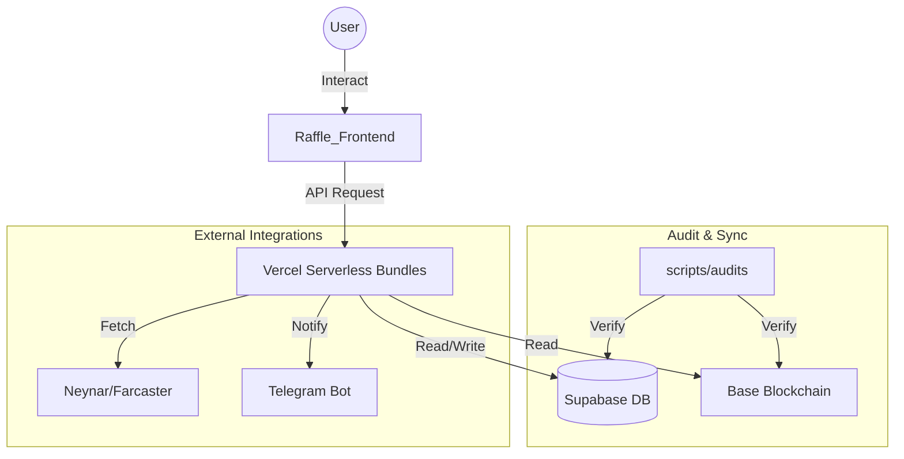

# 🗺️ CRYPTO DISCO LAB - WORKSPACE MAP (v3.64.37-Hardened)
Last Update: 2026-06-05 (14:30)
Current Architecture: Hybrid Vercel-Supabase-Hardhat (Multi-Agent Optimized)
Status: [🟢] OPERATIONAL - BRIDGE v1.3.7 ACTIVE

Dokumen ini adalah referensi utama untuk navigasi folder dan struktur data di seluruh ekosistem. **Agent dilarang menebak lokasi file; gunakan map ini.**

---

## 1. Directory Tree & Purpose

```text
e:\Disco Gacha\Disco_DailyApp
├── .rtk/                    # RTK project-local filters for token-saving command output
├── .agents/                 # 🧠 Intelligence & Protocols (The "Brain")
│   ├── skills/              # Agent skillsets (SKILL.md)
│   │   ├── 30-seconds-of-code        # JS/CSS/HTML utilities
│   │   ├── admin-stability           # Admin dashboard reliability
│   │   ├── agent-customization       # Agent personalization protocols
│   │   ├── ai-evolution-pnl-optimizer # 🧠 AI Yield & Profit Logic
│   │   ├── cognitive-orchestrator     # 🧠 Multi-Agent Cognitive Sync (v1.0)
│   │   ├── deepseek-specialist       # High-logic & Security (v3.56.3)
│   │   ├── deploy-to-vercel          # CI/CD deployment workflows
│   │   ├── design-protocol           # UI/UX "Midnight Cyber" standards
│   │   ├── disco-codebase-builder    # Token-efficient repo build/fix/audit protocol
│   │   ├── economy-profitability-manager # PnL & Zero-Riba Logic
│   │   ├── ecosystem-sentinel        # Audit & Nexus Orchestration
│   │   ├── git-hygiene               # Clean Git Tree Mandate
│   │   ├── lurah-orchestron          # Passive ecosystem monitoring (Vercel Cron)
│   │   ├── meteora-agent             # Meteora LP analysis workflow
│   │   ├── openclaw-specialist       # Security & Architecture Review
│   │   ├── qwen-specialist           # Local Refactoring & Build Check
│   │   ├── raffle-integration        # NFT Raffle frontend logic
│   │   ├── secure-infrastructure-manager # Security & Contract Lifecycle
│   │   ├── supabase                  # DB & Auth integration
│   │   ├── supabase-audit            # Deep DB security checks
│   │   ├── supabase-postgres-best-practices # DB Performance
│   │   ├── vercel-cli-with-tokens    # Vercel environment sync
│   │   ├── vercel-composition-patterns # React Scalability
│   │   ├── vercel-react-best-practices # Performance optimization
│   │   ├── vercel-react-native-skills # Mobile app standards
│   │   ├── vercel-react-view-transitions # Smooth UI animations
│   │   ├── web-design-guidelines     # UI/UX Accessibility
│   │   └── xp-reward-lifecycle       # XP Accrual & Sync logic
│   ├── MASTER_COGNITIVE_MAP.md # Consolidated Master Cognitive Map SOT
│   ├── MASTER_COGNITIVE_MAP.html # Viewable Rendered Cognitive Map
│   ├── workflows.md         # Consolidated Master Workflows SOT
│   ├── workflows.html       # Viewable Rendered Workflows
│   ├── gemini.md            # operational constitution for Gemini
│   ├── VERCEL_ECOSYSTEM_SOT.md # Vercel UI & CLI standards
│   └── WORKSPACE_MAP.md     # This file (Canonical Nav)
│
├── Raffle_Frontend/         # 💻 Main Web Application (Vite + React)
│   ├── Agen Work Report/   # Consolidated agent work reports
│   ├── api/                 # Serverless Backend Bundles (Vercel)
│   │   ├── database.types.ts # 🆕 Canonical Supabase Schema (Generated)
│   │   ├── types.ts          # 🆕 Central Entity Interfaces (Hardened)
│   ├── src/                 # Frontend Source
│   │   ├── components/      # Global UI Components (Shared)
│   │   ├── features/        # Feature-Based Modules
│   │   │   ├── admin/       # 🆕 Hardened Admin Dashboard (v3.63.0)
│   │   │   │   ├── components/ # Modular Admin Components
│   │   │   │   │   ├── tasks/  # Task Management Modules
│   │   │   │   │   └── system/ # Protocol & Economic Configs
│   │   │   │   └── types/      # Strict Administrative Interfaces
│   │   │   ├── profile/     # User Profile & SBT Logic
│   │   │   └── raffle/      # Raffle Core Features
│   │   ├── hooks/           # Business Logic & State Hooks
│   │   ├── lib/             # Core Configs (Supabase, Contracts)
│   │   ├── pages/           # Route-level Page Components (AdminPage.tsx)
│   │   └── services/        # External API Integrations
│   └── vercel.json          # API Routing & Security Headers
│
├── scripts/                 # 🛠️ System Automation & Audits
│   ├── audits/              # CRITICAL: Verification & Health Checks
│   │   ├── check_sync_status.cjs # Most important health script
│   │   └── verify-db-sync.cjs   # Database sync verification
│   ├── sync/                # Data & Contract synchronization
│   │   ├── robust_sync.cjs      # Clean-Pipe Sync Engine (v3.43.0)
│   │   ├── force_onchain_sync.cjs # 🆕 On-Chain to DB Force Sync Daemon (v3.64.36)
│   │   └── sync_vercel_all.cjs  # Multi-Project Sync Trigger
│   ├── deployments/         # CI/CD and deploy helpers
│   │   └── install_rtk.cjs  # 🆕 Local RTK CLI installer (v3.64.6)
│   ├── database/            # DB Schema & Dump tools
│   └── orchestrator/        # Multi-agent orchestrators & bridges
│       ├── gemini_agent_bridge.js # Official Gemini CLI Bridge
│       ├── lurah_brain.cjs      # Ecosystem alerts & heartbeat cron
│       ├── nexus_orchestrator.cjs # Multi-Agent syntax/linter audit pipeline
│       ├── run_freemodel_agents.py # 🆕 Freemodel sub-agents runner
│       └── orchestrate_dashboard_update.py # 🆕 Live monitor dashboard orchestrator
│
├── verification-server/     # 🤖 Telegram Bot & Off-chain verification
│   ├── api/webhook/         # Bot webhooks
│   └── routes/              # Express-style routes
│
├── DailyApp.V.12/           # 📜 Smart Contracts (Hardhat - Architecture V12/V13)
│   └── contracts/           # Solidity source code (DailyAppV13, MasterX, Raffle)
│
├── antigravity_sdk.py       # 🤖 Antigravity Python SDK & Sub-agent Registry
└── PRD/                     # 📄 Product Requirements Documentation
    ├── DISCO_DAILY_MASTER_PRD.md   # Consolidated Supreme Source of Truth
    ├── DISCO_DAILY_MASTER_PRD.html # Viewable Rendered Design Doc
    ├── ROADMAP.html                # Interactive Product Roadmap
    └── _archive/                   # Historical snapshots of versioned SOTs
├── docs/                        # 📄 Project Documentation & Logs
│   └── history/                 # Historical Work Reports
│       └── WORK_REPORTS.md      # Consolidated Historical Work Reports
```

---

## 2. API Bundle & Routing Map

Seluruh API dikonsolidasi ke dalam bundles untuk menghemat limit Vercel (Max 12).

| Source Route | Bundle Target | Action Key | Purpose |
|--------------|---------------|------------|---------|
| `/api/user/*` | `user-bundle.js` | `sync`, `xp`, `update-profile` | User identity, XP sync & **UGC Reward Sync (v3.38.4)** |
| `/api/leaderboard` | `user-bundle.js` | `leaderboard` | Global rankings |
| `/api/cron/reconcile-pending` | `audit-bundle.js` | `reconcile-pending` | Pending sync recovery for confirmed on-chain tx / stuck XP jobs |
| `/api/tasks/*` | `tasks-bundle.js` | `social-verify`, `claim` | Task verification & rewards |
| `/api/admin/*` | `admin-bundle.js` | `task-add`, `system-update` | Administrative controls |
| `/api/raffle/*`| `raffle-bundle.js` | `buy`, `create` | NFT Raffle operations |
| `/api/rpc`     | `audit-bundle.js`  | `rpc` | On-chain hex simulation |

---

## 3. Database Schema (Supabase)

| Table/View | Purpose | Key Columns |
|------------|---------|-------------|
| `user_profiles` | Core User Identity | `wallet_address`, `total_xp`, `tier`, `referred_by`, `is_base_social_verified`, `last_seen_at` |
| `user_activity_logs` | Audit Trail (History) | `category`, `activity_type`, `description`, `tx_hash` |
| `point_settings` | Zero-Hardcode Rewards | `activity_key`, `points_value` |
| `system_settings` | Global System Params | `key`, `value` |
| `v_user_full_profile` | Unified Profile View | Joining profiles with Tier names, SBT stats, and Raffle stats |
| `daily_tasks` | Off-Chain Tasks (Supabase) | `platform`, `action_type`, `xp_reward`, `task_type`, `is_base_social_required` |
| `telegram_chat_history` | Conversational Memory (v3.56.4) | `chat_id`, `role`, `content`, `created_at` |

**Realtime UI Listeners (v3.64.8)**:
- `ProfilePage` / `PointsContext`: listens to `user_profiles` changes for scoped profile XP refresh.
- `HomePage`: single active `/` dashboard source; profile cards hydrate through `user-bundle?action=get-profile` (view + `user_profiles` merge), CMS feature cards use Content CMS, daily claim button is cooldown-guarded from DailyApp V16/DB/local state, and SBT pool shows live MasterX empty-pool telemetry when `totalSBTPoolBalance()` is 0.
- `ActivityLogSection`: listens to `user_activity_logs` and `user_task_claims` changes for user history refresh; dashboard/history reads via `/api/user-bundle?action=get-activity-logs`. `DAILY` is an API virtual category over DB-valid `XP` rows with Daily Claim activity/description.
- `LeaderboardPage`: listens to `user_profiles` changes and refetches `/api/leaderboard`.
- `SBTMintPage` / `SBTUpgradeCard`: after SBT mint receipt success, call `user-bundle` action `sync-sbt-upgrade` with verified `txHash`; backend mirrors tier into `user_profiles` and writes `SBT / Mint` for NFT Gallery/activity history.

**Key `point_settings` Keys** (pattern: `{platform}_{action_type}`):
`daily_claim`, `farcaster_follow`, `x_follow`, `x_repost`, `x_like`, `base_transaction`, `raffle_buy`, `sponsor_task`

**DB Functions (WAJIB digunakan, jangan bypass):**

| Function | Signature | Tujuan |
|----------|-----------|--------|
| `fn_increment_xp` | `(p_wallet TEXT, p_amount INT)` | Atomically increment `user_profiles.total_xp` — dipakai `tasks-bundle.js` setelah off-chain task claim |
| `fn_increment_raffle_tickets` | `(p_wallet TEXT, p_amount INT)` | Increment tiket raffle user |
| `fn_award_referral_bonus` | trigger `trg_referral_bonus` | Auto-award XP ke referrer saat user baru bergabung |

---

## 4. E2E Workflow Diagram (Ecosystem)



---

## 5. Agent Navigation Rules

1.  **Always refer to `scripts/audits/check_sync_status.cjs`** for current system health.
2.  **Every UI change** must happen in `Raffle_Frontend/src/components` or `pages`.
3.  **Every API change** must respect the existing bundle structure in `Raffle_Frontend/api/`.
4.  **No local script execution** without checking `scripts/` subfolders first to avoid duplication.
5.  **ZERO-HARDCODE MANDATE (v3.59.1)**: Prohibit use of static contract addresses in any source file or ABI definition. Pull exclusively from `.env`.
6.  **TYPESCRIPT HARDENING MANDATE (v3.61.0)**: All serverless API code in `Raffle_Frontend/api/` MUST be strictly typed. Implicit `any` is prohibited. Error handling MUST use the `unknown` catch pattern with explicit type guards.
7.  **GIT HYGIENE MANDATE**: Never commit `.env.vercel*` or temporary audit logs. Run `Remove-Item tsc_output*.txt` before closing tasks.
8.  **RTK TOKEN SAVINGS MANDATE**: All agents must prefer RTK wrappers for token-heavy terminal work. On this Windows workspace, use the local binary form first (`.\.bin\rtk.exe git`, `.\.bin\rtk.exe read`, `.\.bin\rtk.exe npx`, `.\.bin\rtk.exe npm`, `.\.bin\rtk.exe grep`, `.\.bin\rtk.exe gain`) because bare `rtk` may not be on PowerShell `PATH`. Review `.rtk/filters.toml` and run `.\.bin\rtk.exe trust` before relying on project filters. Fall back to native PowerShell only when RTK cannot wrap the command safely.

---

## 6. Contract & Governance Registry (v3.46.0)

| Contract | Base Mainnet (8453) | Base Sepolia (84532) | Governance |
|----------|---------------------|----------------------|------------|
| **MasterX (New)** | `[RESERVED]` | `0x1b573DdD9a1679505ae64498564523222c758EC2` | `Ownable2Step` ✅ |
| **Raffle (New)** | `[RESERVED]` | `0xaE8fe1d4D566D438a7ac410c4bE23daD94Fe85B7` | `Ownable2Step` ✅ |
| **DailyApp V16** | `[RESERVED]` | `0xb592D6819Ea310d83034cD80FDDC2e754D0a5353` | `UUPS + role-gated XP + Admin AccessControl UI` ✅ |
| **DailyApp V15** | `[RESERVED]` | `0x0D6f339795EeA5129461388F25dE4f87e92b8DA2` | `AccessControl` (LEGACY) |
| **DailyApp V14** | `[RESERVED]` | `0x888fE02bd09642de385E55DdC6D8a7Ab5580f834` | `AccessControl` (DEPRECATED) |
| **DailyApp V13.2** | `[RESERVED]` | `0x81D65Cc9267e2eBF88D079e3598Ec78f48aE4B5D` | `AccessControl` (DEPRECATED) |
| **CMS V2** | `[RESERVED]` | `0xd992f0c869E82EC3B6779038Aa4fCE5F16305edC` | `AccessControl` ✅ |
| **MasterX (Legacy)** | `[RESERVED]` | `0x980770dAcE8f13E10632D3EC1410FAA4c707076c` | `Ownable` |
| **Raffle (Legacy)** | `[RESERVED]` | `0xE7CB85c307f1c368DCB9FFcfa5f3e02324eaf1f3` | `Ownable` |

**Active Admin Wallet**: `0x52260C30697674A7C837feb2Af21BbF3606795C8`

**DailyApp V16 ENV / Admin Rule**: Frontend and agents MUST prefer `VITE_DAILY_APP_V16_ADDRESS`. Production role handover uses Admin Dashboard -> Role Management -> DailyApp V16 AccessControl (`grantRole` first, verify, then `revokeRole` old deployer target).

**DailyApp V16 ABI/runtime rule**: DailyApp frontend ABI sources are `Raffle_Frontend/src/lib/daily_app_abi.json` and `Raffle_Frontend/src/lib/abis_data.txt`, synced from `artifacts/contracts/DailyAppV16.sol/DailyAppV16.json`. V13/V15-only sponsorship, off-chain XP sync, and entitlement selectors are legacy-only and must not be called against the V16 proxy.

## 6b. Vite 8 Windows Build Resolution Protocol (v2026-05-26)

⚠️ **SEMUA AGEN WAJIB TAHU**: Vite 8 menggunakan **rolldown** (bundler Rust) sebagai default, menggantikan Rollup.

### Masalah
- `npx vite build` dari root `e:\Disco Gacha\Disco_DailyApp\` memanggil Vite 8 global dari npm cache
- rolldown gagal resolve `index.html` di subdirektori `Raffle_Frontend\` di Windows
- Error: `[UNRESOLVED_ENTRY] Cannot resolve entry module index.html`

### Solusi Aman
```bash
cd Raffle_Frontend && node node_modules/vite/bin/vite.js build
```
Ini memanggil Vite **lokal** project (masih Rollup), bukan Vite 8 global dengan rolldown.

### Aturan Build:
1. **Vercel Deploy tidak terpengaruh** — Vercel pakai Vite lokal dari `node_modules` project
2. **npm run build** otomatis pakai Vite lokal karena npm prioritaskan `node_modules/.bin` lokal
3. **Jangan upgrade Vite ke v8** — tetap di versi 5/6 (Rollup) sampai rolldown stabil di Windows + ekosistem React
4. **Jika build gagal** → cek dulu apakah menggunakan Vite global dengan `npx vite --version`. Jika versi >= 8, panggil Vite lokal manual

### Verifikasi Build Berhasil
```
Raffle_Frontend/dist/
├── .well-known/
├── assets/
└── index.html
```

## 7. Mandatory Agent Reading Protocol

Saat perintah **"re-read skills"** diberikan, agent WAJIB membaca file berikut secara berurutan:

1. `.cursorrules` — Master Architect Protocol
2. `.agents/skills/ecosystem-sentinel/SKILL.md` — Audit & Orchestration
3. `.agents/skills/git-hygiene/SKILL.md` — Clean Git Mandate
4. `.agents/skills/raffle-integration/SKILL.md` — Raffle Standards
5. `.agents/WORKSPACE_MAP.md` — Navigation Map (this file)
6. `PRD/TASK_FEATURE_WORKFLOW.md` — 🎯 **Task Feature E2E Workflow (MANDATORY)**
7. `.agents/skills/agent-customization/SKILL.md` — Agent Personalization
8. `.agents/skills/30-seconds-of-code/SKILL.md` — JS/CSS Utilities
9. `PRD/FEATURE_WORKFLOW_SOT.md` — Feature Workflow SOT
10. `.agents/VERCEL_ECOSYSTEM_SOT.md` — 🌐 Vercel Deploy & UI Guidelines
11. `PRD/ACCOUNTANT_LEDGER_SOT.md` — 📊 **Accountant Ledger SOT (Financial Integrity)**
12. `PRD/DISCO_DAILY_MASTER_PRD.md` — Master PRD
12. `.agents/skills/meteora-agent/SKILL.md` — Meteora Data Protocol
13. `.agents/WORKSPACE_MAP.md` — Navigation Map (this file)
14. `.agents/gemini.md` — Operational Constitution
15. `.cursorrules` — Master Architect Protocol

---
*Last Updated: 2026-06-05T14:30:00+07:00 | Dependency Security Hardening & Vite 6 Upgrade. v3.64.37 LOCKED.*
