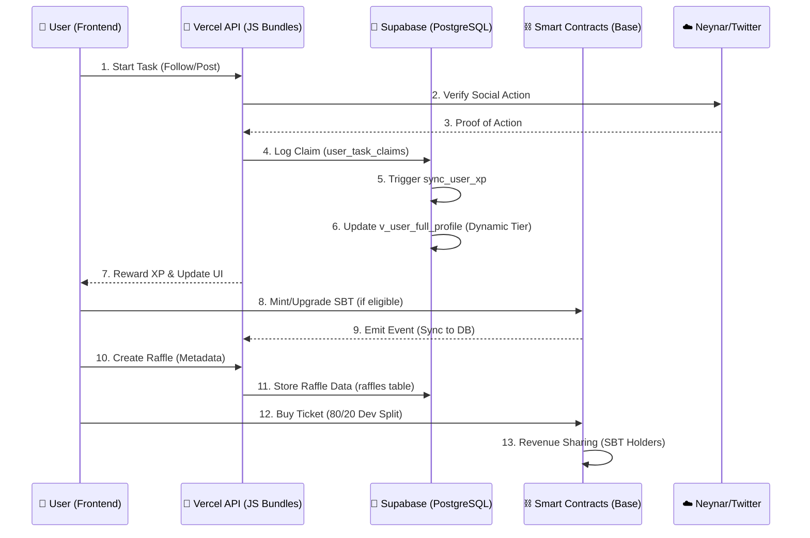

# 🪩 Crypto Disco App - Master PRD (Product Requirements Document)

## 1. Project Overview
Crypto Disco App is a Web3-native social engagement platform built on **Base**. It gamifies community growth through a Daily Gacha/Mojo system, incentivizing social actions (Farcaster/Twitter) with XP, dynamic SBT tiers, and a revenue-sharing ecosystem.

### Core Value Proposition
- **Proof of Action**: Multi-platform social verification (Farcaster, Twitter).
- **Economic Loop**: Platform revenues (fees/sponsorships) are shared back with the community via SBT tiers.
- **Identity & Reputation**: Soulbound Token (SBT) NFTs that evolve based on activity (XP) and verified personhood.

---

## 2. Integrated Ecosystem Flow
The platform is designed as a closed-loop engagement engine where social activity feeds on-chain status, which in turn unlocks economic rewards.

---

## 3. Product Features & Halaman (Pages)

### 🖼️ Frontend Interface
- **🏠 HomePage**: Activity feed, daily bonus hub, and quick quest access.
- **🎯 TasksPage**: Central hub for all social quests (Farcaster/Twitter). Includes verification feedback.
- **🎟️ RafflesPage**: Gallery of community-created raffles with status filters (Active/Ended).
- **➕ CreateRafflePage**: Rich form for UGC Raffle creation with live preview and metadata encoding.
- **📊 LeaderboardPage**: Global and Tier-based ranking. Shows XP, Raffle Wins, and dynamic Rank Names.
- **👤 ProfilePage**: Comprehensive user dashboard showing Stats (XP, Wins), NFT Tiers, and Activity History.
- **📢 CampaignsPage**: Featured partner quests and special event discovery.
- **🔐 LoginPage**: Wallet connection (Wagmi/RainbowKit) and Farcaster FID synchronization.

### 👤 User Profile & Reputation
- **Wallet-Centric Identity**: No traditional logins; interaction is 100% wallet-based.
- **Dynamic Tiers (Leaderboard)**: 
    - **Rookie (0), Bronze (1), Silver (2), Gold (3), Platinum (4), Diamond (5)**.
    - Multipliers from **1.00x to 1.50x** (SBT Tier Multiplier).
    - Status-based ranking prioritized over XP percentiles.
    - Calculated in real-time in the database (`v_user_full_profile`).
- **Activity Logging**: Every XP-earning event, purchase, or claim is tracked in `user_task_claims`.

---

## 4. Administrative & Economic Control

### 👑 Admin Dashboard ("Lurah" Hub)
Accessible via `/admin`, this dashboard is the central nerve center for the ecosystem:
- **Economy Metrics**: Real-time monitoring of ETH/USDC balances across all contracts.
- **Raffle Manager**: Moderate community raffles, adjust fees, and monitor prize distributions.
- **Role Management**: Grant/Revoke `ADMIN_ROLE` and `VERIFIER_ROLE` to wallets.
- **Blockchain Config**: Live updates to contract addresses (USDC, Raffle, DailyApp) and RPC endpoints.
- **System Settings**: Adjust global parameters like `tier_percentiles`, XP values, and cooldowns.

### 💰 Revenue Sharing & Dividends
- **80/20 Creator Split**: For UGC Raffles, 80% goes to prizes/creator and 20% to the platform.
- **SBT Dividend Pool**: 30% of platform revenue is piped into the SBT community pool.
- **Tier-Weighted Distribution**: Diamond (x10), Platinum (x5), Gold (x3), Silver (x2), and Bronze (x1) relative weights. Distribution is dynamic based on total holders per tier.

---

## 5. Technical Infrastructure

### 🏗️ Technology Stack
- **Frontend**: React (Vite), Vanilla CSS (Premium Dark Theme), Lucide Icons.
- **Smart Contracts**: 
    - `DailyAppV13.sol`: Main logic for points, streaks, and admin settings.
    - `CryptoDiscoMaster.sol`: Revenue sharing and tier weights.
    - `RaffleV2`: ERC721-based raffle mechanics with Chainlink/QRNG.
- **Backend (Serverless)**: Vercel Functions (Node.js/Ethers).
- **Database**: Supabase.
    - **PostgreSQL**: Relational storage for profiles and history.
    - **RLS**: Security Invoker views for frontend safety.
    - **Triggers**: Automatic XP and Tier sync.

### 📡 API & JS Logic Bundles
The backend is organized into functional bundles for maintainability:
- **`user-bundle.js`**: Core profile management, FID synchronization, global leaderboard logic, and SBT minting.
- **`tasks-bundle.js`**: Verification logic for social tasks and secure XP granting.
- **`raffle-bundle.js`**: UGC Raffle state management, prize claim validation, and winner tracking.
- **`admin-bundle.js`**: Low-level "Lurah" commands for contract maintenance and parameter tuning.
- **`audit-bundle.js`**: Automated ecosystem health checks and event synchronization.

### ⛓️ Database Key Architecture
| Component | Implementation |
| :--- | :--- |
| **Auth** | Farcaster FID synced to Wallet Address via Neynar. |
| **XP Sync** | Trigger `trg_sync_xp_on_claim` ensures `total_xp` is always authoritative. |
| **Tier Calc** | `v_user_full_profile` uses `PERCENT_RANK()` for competitive tiering. |
| **Security** | `SECURITY INVOKER` views prevent data leaks via Supabase RLS. |

---

## 6. Webhooks & Integrations
- **Neynar**: Secure bridge for Farcaster identity and social action proof.
- **Chainlink VRF/QRNG**: Cryptographic randomness for transparent raffle draws.
- **Vercel Cron**: Scheduled tasks for event synchronization and daily resets.

---

## 7. Security & Audit Mandates
- **Gitleaks**: Active scanning on every commit/push to prevent secret exposure.
- **AdminGuard**: Tier-1 routes protected by wallet-signature checks and admin-role verification.
- **Audit Logs**: Every sensitive action (XP claim, metadata change) is logged for forensic review.

---
**Status**: Active Production  
**Network**: Base Sepolia (Testnet) / Base Mainnet (Launch Ready)
