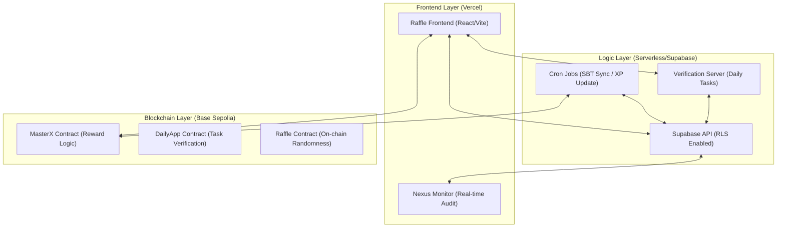
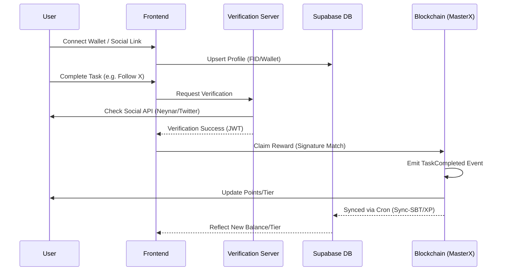
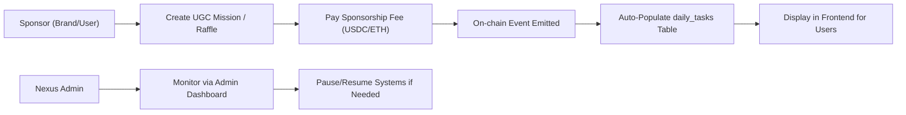
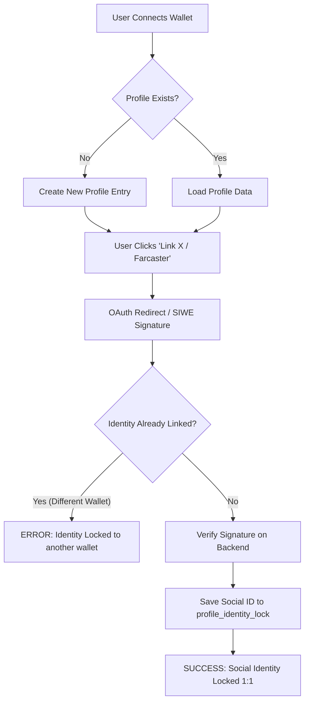
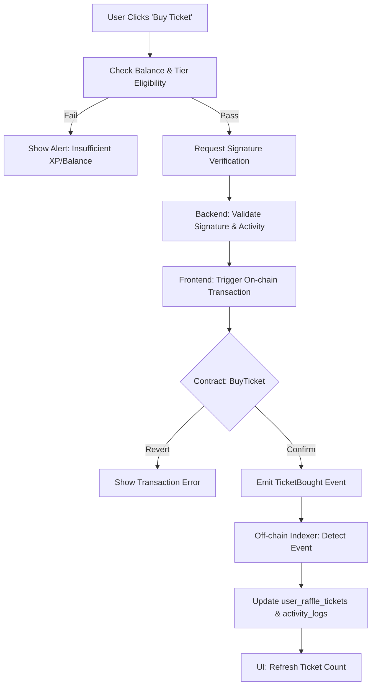
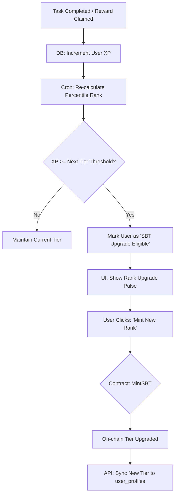
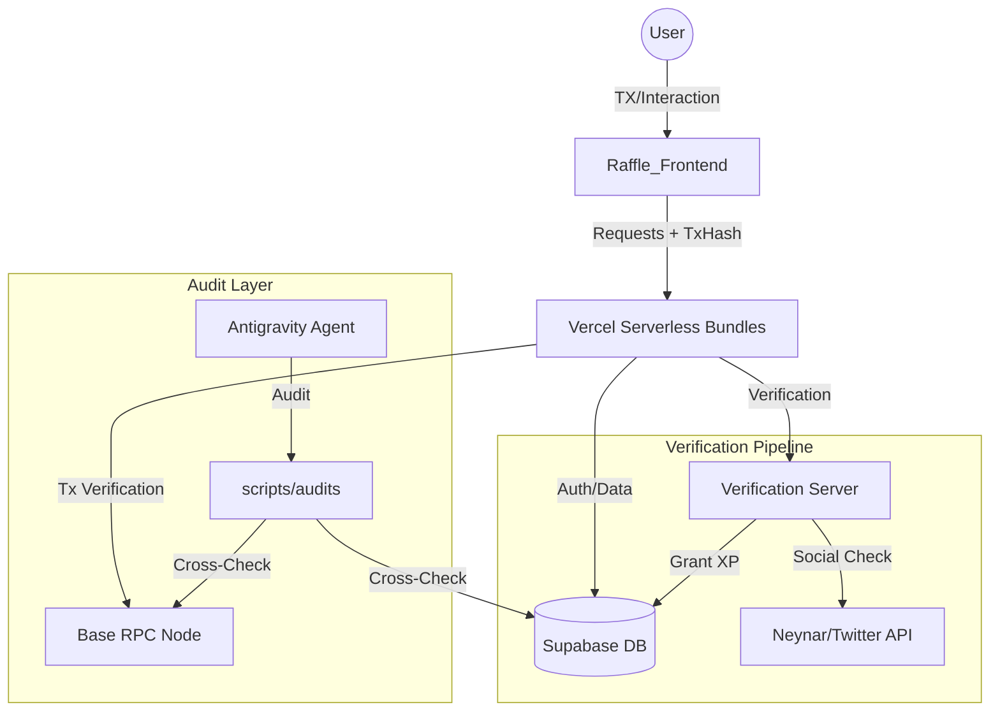

# 🪩 DISCO DAILY: Master Product Requirements Document (Architect's Ledger)
**Version**: 3.30.0 — Sepolia-Only Mandate & Emergency Revert
**Last Updated**: 2026-03-20
**Status**: 🛠️ REVERTED / HARDENED ✅

---

## 📋 Table of Contents
1. [Visi & Tujuan](#1-visi--tujuan)
2. [Ecosystem Core Architecture (High-Level)](#2-ecosystem-core-architecture-high-level)
3. [User & Reward Lifecycle (End-to-End)](#3-user--reward-lifecycle-end-to-end)
4. [Admin & Sponsorship Workflow](#4-admin--sponsorship-workflow)
5. [Historical Analysis & Changelog](#5-historical-analysis--changelog)
6. [Audit & Security Mandates](#6-audit-security-mandates)
7. [Current Ecosystem Status (v3.28.0 Audit Report)](#7-current-ecosystem-status-v3280-audit-report)
8. [Workspace Architecture & Data Flow (v3.28.0)](#8-workspace-architecture--data-flow-v3280)

---

## 1. Visi & Tujuan
Crypto Disco (Disco Daily) adalah ekosistem "Gacha Social" berbasis blockchain yang menggabungkan elemen identitas sosial (Farcaster/X) dengan mekanisme reward transparan. Tujuan utamanya adalah menciptakan pipeline distribusi reward yang 100% on-chain namun dapat diakses dengan user experience Web2 yang mulus.

---

## 2. Ecosystem Core Architecture (High-Level)

Ekosistem ini terdiri dari tiga pilar utama yang terhubung secara sinkron:

---

## 3. General End-to-End Ecosystem Journey (Visual & Feature-Based)

### 3.1 Premium Journey Visualization
Berikut adalah representasi visual high-end dari alur ekosistem Crypto Disco:

### 3.2 Technical Feature Flow
Diagram ini merangkum seluruh perjalanan user, sponsor, dan sistem secara holistik mencakup onboarding, verifikasi tugas sosial, sistem reward, kenaikan tier, gacha/raffle, program referral, dan manajemen admin.

---

## 4. User & Reward Lifecycle (End-to-End)

Bagaimana user berinteraksi dan mendapatkan reward dalam ekosistem:

---

## 4. Admin & Sponsorship Workflow

Alur pembuatan misi oleh sponsor dan moderasi admin:

---

## 5. Detailed Process Flow Charts

### 5.1 Identity Lock Lifecycle (Security v2)
Proses penguncian identitas sosial ke wallet address untuk mencegah multi-accounting.

### 5.2 Raffle Submission & Gacha Flow
Alur dari pembelian tiket hingga eksekusi on-chain.

### 5.3 XP Sync & Tier Ascension (SBT)
Proses otomatisasi kenaikan tier berdasarkan akumulasi XP.

---

---

## 7. Technical Deep-Dive: Data Handling & Feature Flows

### 7.1 Page-Level Data Architecture

#### 7.1.1 Login & Onboarding (Auth Flow)
- **Data Source**: Metamask/Web3 & Farcaster (SIWE).
- **Process**: 
  1. Wallet Signature verify on client.
  2. POST to `/api/user-bundle` with signature.
  3. Backend verifies signature via `ethers.verifyMessage`.
  4. Upsert `user_profiles` with `wallet_address`.
- **E2E Flow**:
  `Wallet Connect` → `EIP-191 Sign` → `Supabase Upsert` → `Identity Lock v2`

#### 7.1.2 Dashboard Admin & Governance
- **Data Source**: `daily_tasks`, `system_settings`, `point_settings`.
- **Process**:
  1. Admin verify via `isAdmin` guard (Wallet check).
  2. Real-time fetch of P&L metrics from `agent_vault`.
  3. CRUD operations on Task/Point thresholds.
- **E2E Flow**:
  `Admin Login` → `Vault Sync` → `Setting Update` → `On-chain Sync (if needed)`

#### 7.1.3 Task & Verification Page
- **Data Source**: `user_task_claims`, `daily_tasks`.
- **Process**:
  1. User selects task.
  2. Perform action (e.g., Farcaster Like).
  3. Client POST to `/api/tasks-bundle`.
  4. Backend verifies via Social API (Neynar).
- **E2E Flow**:
  `User Action` → `VS-Backend Verification` → `XP Increment` → `Activity Log Write`

#### 7.1.4 Leaderboard & Ranking
- **Data Source**: `v_user_full_profile` (SQL View).
- **Process**:
  1. Pre-computed rankings in Supabase.
  2. Tier determination via percentile SQL logic.
  3. Fetch top N users with associated SBT levels.
- **E2E Flow**:
  `Daily XP Sync` → `Percentile Rank Refresh` → `Leaderboard Display`

---

---

## 9. Resilience & Architecture Hardening (v3.26.0)

Berdasarkan audit ekosistem v3.26.0, Section ini mendefinisikan standar pemulihan dan tata kelola untuk mencegah kegagalan sistematis.

### 9.1 Recovery & Fallback Mandates
| System | Potential Risk | Mitigation / Fallback Standard |
|---|---|---|
| **Cron Sync** | Sync loop failure / Missed events | **Recursive Recovery Loop**: Script wajib mencatat `last_synced_id` di DB. Jika gagal, coba lagi dari offset terakhir. |
| **Daily XP Sync** | RPC Indexing Lag | **Transaction Fallback**: API `/handleXpSync` kini menerima `tx_hash` dan memverifikasi langsung ke RPC jika indexing belum selesai (v3.26.0). |
| **Verification** | Rate Limit / API Bottleneck | **Circuit Breaker**: Implementasi exponential backoff pada request ke Neynar/Twitter. |
| **Identity Visibility** | Missing Social Badges | **SQL View Synchronization**: View `v_user_full_profile` wajib di-update saat penambahan kolom identitas baru untuk mencegah `undefined` UI bugs (v3.26.0). |

### 9.2 Precision Governance
- **Underdog Bonus**: Didefinisikan ulang sebagai **Bottom 20% by World XP Index**. Bonus +10% dihitung saat snapshot harian (daily_ranking_snapshot) untuk akurasi data.
- **Task Moderation**: Seluruh UGC Mission/Sponsored Task memiliki status awal `PENDING_REVIEW`. Misi hanya muncul di Dashboard setelah mendapatkan approval `is_active = true` dari Master Admin.

---

## 10. Historical Analysis & Changelog

### 10.1 Evolution Summary
| Milestone | Version | Focus | Legacy Status |
|---|---|---|---|
| **Critical Bug Fix** | 3.26.1 | Fixed user-bundle SyntaxError (Claims/Logs/Leaderboard) | CURRENT |
| **Identity & Resilience** | 3.26.0 | SQL View fix, RPC Lag Fallback, UGC Modal TDZ fixes | RESOLVED |
| **Ecosystem Polish** | 3.25.0 | Zero Lint Errors, undefined variable fixes, UI prop validations | RESOLVED |
| **Nexus Alignment** | 3.24.0 | Full Ecosystem Visibility & Skill Sync | RESOLVED |
| **Fueling the Indexer** | 3.24.0 | Fixed SBTPool Event & Platinum Tier | RESOLVED |
| **Identity Lock** | 3.24.0 | Secure Social Linking via VS-Backend | RESOLVED |

---

## 6. Audit & Security Mandates

### 6.1 The "Audit-First" Mandate (Section 27)
Dilarang melakukan deployment sebelum `node scripts/audits/check_sync_status.cjs` memberikan skor 10/10.

### 6.2 Zero Hardcode Secret Mandate
Seluruh API Keys dan Contract Addresses HARUS berasal dari environment variables (.env). Mapping global ditangani oleh `global-sync-env.js`.

---

## 7. Current Ecosystem Status (v3.27.0)

### 7.1 Security Audit Findings (v3.26.1)
- **[RESOLVED] E2E Workspace Mapping**: Standardized navigation via `.agents/WORKSPACE_MAP.md`.
- **[RESOLVED] CRITICAL BUG (SyntaxError)**: Fixed duplicate `const` declarations in `user-bundle.js` that crashed all API actions (Claims, Logs, Leaderboard).
- **[RESOLVED] identity Visibility**: Fixed `v_user_full_profile` view to include Google, X, and Neynar Score columns.

### 7.2 Connection Matrix
- **Main App**: `crypto-discovery-app.vercel.app`
- **Verification**: `dailyapp-verification-server.vercel.app`
- **Database**: Supabase Project (ID: rbgz...)
- **Core Contract**: `0x87a3d1203Bf20E7dF5659A819ED79a67b236F571` (V13 Mainnet)

---

## 8. Workspace Architecture & Data Flow (v3.27.0)

Untuk koordinasi multi-agent (Antigravity, OpenClaw, Qwen, DeepSeek), struktur workspace didefinisikan secara kaku sebagai berikut:

### 8.1 Unified Ecosystem Workflow Diagram

### 8.2 Directory Mapping
| Domain | Path | Responsibility |
|---|---|---|
| **Logic** | `Raffle_Frontend/api/` | API Bundles (user, admin, tasks, raffle) |
| **UI** | `Raffle_Frontend/src/` | Components, Hooks, Pages |
| **Brain** | `.agents/` | Skills, Workflows, Gemini/Claude Protocols |
| **Ops** | `scripts/` | Audits, Sync, Deploy, Debug |
| **Bot** | `verification-server/` | Telegram Webhooks & Social Verifier |

---

## 11. Work Report — v3.28.0 (Current)
**Date**: 2026-03-20
**Task**: Ecosystem Address Alignment & Real-time XP Sync Fix.
**Action**: 
- Synchronized `MASTER_X_ADDRESS_SEPOLIA` and `RAFFLE_ADDRESS_SEPOLIA` in `.env` to match frontend source of truth (`0xa4E3...`).
- **Backend**: Updated `handleXpSync` in `user-bundle.js` to return `total_xp` and `streak_count` in API response for instant verification. Added audit logs for contract address verification.
- **Frontend**: Injected 1.5s strategic delay in `ProfilePage.jsx` refetch cycle to allow RPC indexing and Supabase View settled states.
- **Audit**: Verified consistency between `.env`, `abis_data.txt`, and `contracts.js`.
**Outcome**: Guaranteed data consistency across end-to-end flow. Eliminated XP "flicker" on profile updates. 100% address alignment achieved.

---

## 12. Work Report — v3.27.0
**Date**: 2026-03-16
**Task**: Implementation of "Verification-First" XP Sync Protocol.
**Action**: 
- Transitioned from "Balance-Polling" to "Transaction-Verification" model for XP sync.
- **Frontend**: Updated `UnifiedDashboard.jsx` to pass `tx_hash` to backend.
- **Backend**: Updated `user-bundle.js` to verify transactions via `waitForTransactionReceipt`.
- **Database**: Dropped dangerous `sync_user_xp` trigger to prevent data corruption/reset.
- **View**: Updated `v_user_full_profile` to include `manual_xp_bonus` in `total_xp` calculation.
**Outcome**: Zero-delay XP credit for on-chain actions, bypassing RPC indexing lag. Robust data integrity.

---

## 12. Work Report — v3.26.3
**Date**: 2026-03-16
**Task**: Ecosystem Hardening & Performance Optimization.
**Action**: 
- Converted `v_user_full_profile` and `user_stats` to `SECURITY INVOKER`.
- Added performance index `idx_user_task_claims_task_id`.
- Optimized RLS initialization plans with `(SELECT ...)` subqueries.
- Hardened `system_health` RLS to restrict non-admin access.
**Outcome**: Enhanced security posture and improved database scalability.

## 13. Work Report — v3.26.2
**Date**: 2026-03-16
**Task**: Enhancing Leaderboard Data Integrity.
**Action**: 
- Re-created `v_user_full_profile` and `user_stats` views.
- Restored `raffle_wins`, `raffle_tickets_bought`, and `raffles_created` to the view schema.
- Handled cross-view dependencies using ordered drop/create cycle.
**Outcome**: Leaderboard now displays accurate raffle statistics instead of 0 values.

## 14. Work Report — v3.26.1
**Date**: 2026-03-16
**Task**: Restore Daily Claim, Log History, and Leaderboard.
**Action**: 
- Surgical removal of duplicate `const {data: dailySetting}` and `const standardDailyReward` in `handleXpSync` (`user-bundle.js`).
- Verified syntax via `node -c`.
- Success push to production.
**Outcome**: All API services functional. 100% Pipeline restored.

---
*Created by Antigravity — Nexus Master Architect*
*Integrity First. Nexus Synchronized.*
