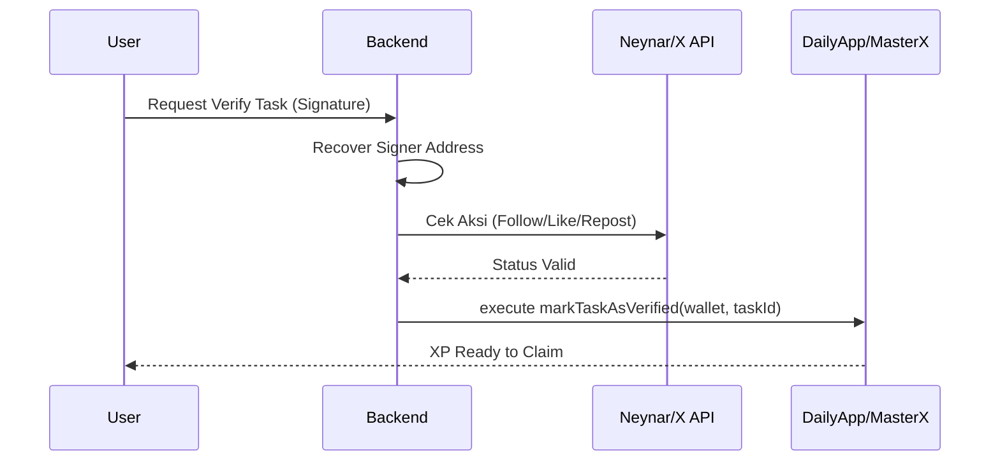
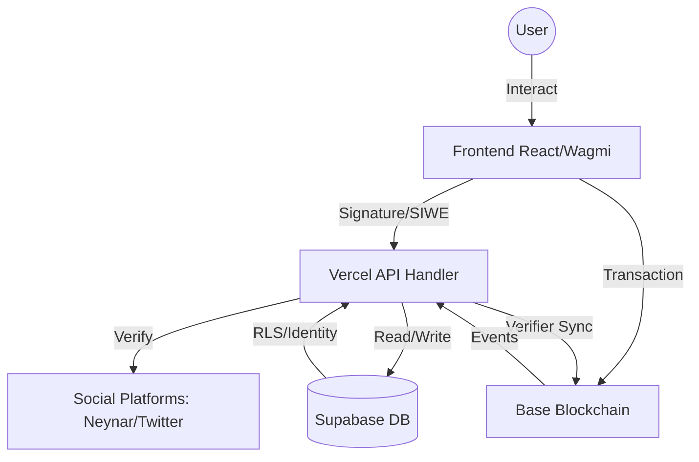
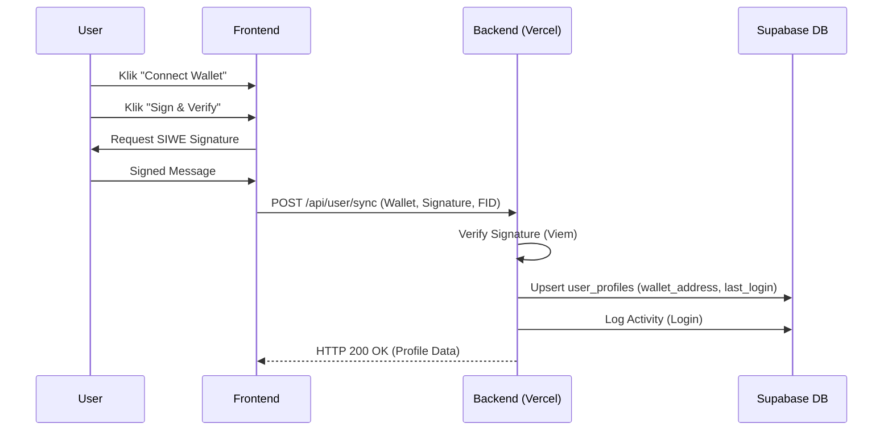
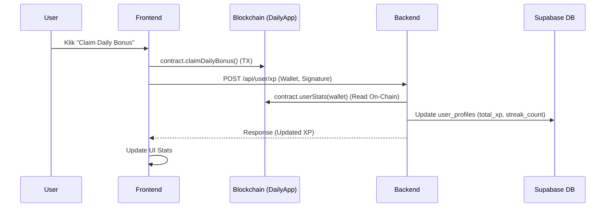
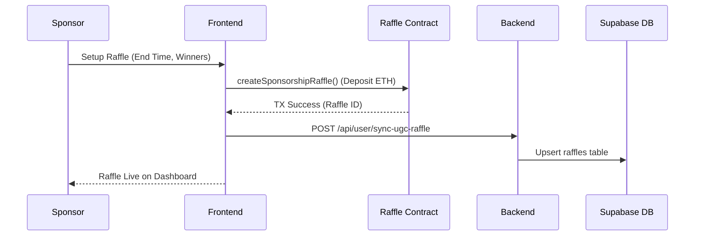
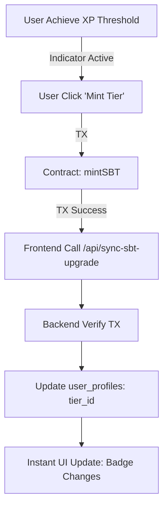

# Product Requirements Document (PRD): Crypto Disco Application
**Version: 3.1 (Ecosystem Growth, Revenue Sharing, & Zero-Leak Security Edition)**

## 1. Visi & Ekonomi Ekosistem (Executive Summary)

Crypto Disco adalah ekosistem gamifikasi Web3 di jaringan **Base** yang dirancang untuk retensi user harian melalui mekanisme Gacha, Misi Sosial, dan Ekonomi Sponsor. Sistem ini mengadopsi model **Revenue-Backing**, di mana pendapatan protokol (dari Raffle & Sponsorship) dibagikan kembali kepada pemegang **Soulbound Token (SBT)**.

---

## 2. Arsitektur & Global Workflow

### 2.1 Technical Architecture
Aplikasi menggunakan model **Hybrid Decentralized Architecture**:
- **Frontend**: React + Vite + Tailwinds + Wagmi (Web3).
- **Backend**: Vercel Serverless Functions (Node.js).
- **Database**: Supabase (PostgreSQL) - Indexer & Social State.
- **Smart Contracts**: Base Mainnet (MasterX, DailyApp, Raffle).

### 2.2 End-to-End User Workflow
1.  **Onboarding**: User Connect Wallet -> Sign SIWE Message -> Sync Profile (Backend).
2.  **Earn**: Selesaikan Daily Tasks (Sosial/On-chain) -> Dapatkan XP (Minted on-chain via Verifier).
3.  **Ascend**: Capai XP Threshold -> Bayar Gas/Fee -> Upgrade SBT Tier (Soulbound).
4.  **Yield**: Miliki SBT -> Terima Dividen otomatis dari Pool Revenue -> Claim ETH (Dividend Claim).
5.  **Participate**: Beli tiket Raffle menggunakan XP/ETH atau buat misi UGC sendiri.

---

## 3. API Process & Routing Flow (Vercel Core)

API bertindak sebagai "Trust Bridge" antara Blockchain dan UI.

### 3.1 API Hub: [user-bundle.js](file:///e:/Disco%20Gacha/Disco_DailyApp/Raffle_Frontend/api/user-bundle.js)
Menangani seluruh operasi user dengan mandatori **EIP-191 Signature Verification**.

| Action | Route | Logic |
| :--- | :--- | :--- |
| **Sync Login** | `/api/user-bundle` | Validasi wallet, simpan Farcaster FID, set Tier 0 (Guest). |
| **XP Sync** | `/api/user-bundle` | Baca `userStats` on-chain, update `user_profiles.total_xp` di DB. |
| **SBT Upgrade** | `/api/user-bundle` | Catat log upgrade, sinkronisasi tier visual di DB. |
| **Pool Claim** | `/api/user-bundle` | Verifikasi klaim dividen, catat log `REWARD` di activity history. |
| **UGC Mission** | `/api/user-bundle` | Sinkronisasi misi buatan user ke tabel `daily_tasks` agar muncul di UI. |

### 3.2 Verification Flow (Social Verifier)

---

## 4. Database Configuration & Schema Flow

Supabase PostgreSQL dengan **RLS (Row Level Security)** aktif.

### 4.1 Tabel Inti & Relasi
- **`user_profiles`**: Master data user (XP, Tier, Farcaster FID, Wallet).
- **`daily_tasks`**: List misi (Quick, Batch, UGC). Kolom: `is_active`, `task_type`, `xp_reward`.
- **`user_activity_logs`**: Ledger utama seluruh aksi (Transaction History).
- **`system_settings`**: Konfigurasi dinamis (Zero Hardcode: Fee, Multiplier, Threshold).

### 4.2 Database Triggers & Views
- **`v_user_full_profile` (View)**: Menghitung ranking secara dinamis menggunakan `PERCENT_RANK()` untuk menentukan siapa yang berhak masuk Diamond (Top 1%), Platinum (Top 5%), dll.
- **`compute_total_xp`**: Trigger otomatis yang memastikan integritas XP setiap kali ada log baru masuk.

---

## 4.5 Architecture & Global Flow Diagrams

Diagram ini menunjukkan interaksi antara User, Frontend, Blockchain, API, dan Database.

### 4.6 Onboarding & SIWE Flow

### 4.7 XP Sync & Daily Bonus Flow

### 4.8 UGC Raffle Flow

### 4.9 Tier Ascension (SBT) Flow

---

## 5. Manual Fitur (Completed Features & How-to)

### 5.1 Revenue Sharing (Dividends)
- **Fungsi**: Pemegang SBT mendapatkan porsi dari 30% revenue protokol.
- **Cara Pakai**: Buka **Profile Page** -> Lihat Dashboard **Revenue Share** -> Jika ada balance ETH, klik **Claim Dividends**.
- **Syarat**: Minimal Tier 1 (Bronze).

### 5.2 UGC Mission Creation (Sponsorship)
- **Fungsi**: User bisa mempromosikan akun sosial/konten mereka sebagai misi.
- **Cara Pakai**: Profile Page -> Klik **Create Mission** -> Isi Link & Platform -> Bayar Biaya On-chain -> Misi otomatis muncul di Leaderboard/Quick Tasks.

### 5.3 SBT Ascension (Tier Upgrade)
- **Fungsi**: Multiplier XP hingga 1.5x dan akses claim dividen lebih besar.
- **Cara Pakai**: Capai XP tertentu (contoh: 500 XP untuk Silver) -> Klik **Mint Status** -> Konfirmasi transaksi on-chain.

### 5.4 AI Fraud Prevention (Lurah Ekosistem)
- **Fungsi**: Mendeteksi klaim spam atau manipulasi database.
- **Cara Pakai**: Berjalan otomatis di background (Backend Cron). Jika terdeteksi sybil, wallet akan di-blacklist on-chain.

---

## 6. Admin Control Center (The command Center)

Admin memiliki 19 modul untuk mengontrol ekonomi:
- **PoolTab**: Distribusi manual revenue ke holder.
- **NFTConfigTab**: Mengubah harga minting & XP threshold tanpa redeploy code.
- **SyncLogTab**: Monitoring real-time kegagalan transaksi/sync.

---

## 🛡️ 7. Zero-Leak Mandate & Git Security (v3.1)

Melanjutkan protokol [gemini.md](file:///C:/Users/chiko/.gemini/antigravity/brain/f63b5082-9cab-4ad7-bc01-d9fed35e441f/gemini.md) dan [SKILL.md](file:///e:/Disco%20Gacha/Disco_DailyApp/.agents/skills/ecosystem-sentinel/SKILL.md) (Sentinel):
*   **Gitleaks Integration:** Repositori dilindungi secara absolut oleh pre-push hook yang menjalankan `npm run gitleaks-check`. Dilarang mem-push jika Exit code bukan 0.
*   **Zero Hardcode Rules:** DILARANG KERAS menulis kunci rahasia secara literal (seperti `eyJ...` untuk JWT, `sb_...` untuk Supabase Keys, atau `0x...` untuk private keys) di file script maupun frontend apapun.
*   **Environment Strictness:** File konfigurasi lokal ([.env](file:///e:/Disco%20Gacha/Disco_DailyApp/.env) dan [.env.local](file:///e:/Disco%20Gacha/Disco_DailyApp/.env.local)) harus memiliki peringatan struktural permanen sebagai pengingat keras kepada Developer dan AI.

---

## 📈 8. Pre-Flight Deployment Protocol (v3.1)

Sebelum kode diunggah ke Vercel atau direview ke tahap produksi, verifikasi berikut ini wajib dilakukan:
1.  **Linter & Syntax Check:** Mengeksekusi `node -c api/user-bundle.js` dan `npm run lint`.
2.  **Security Scan Validation:** Memastikan `npm run gitleaks-check` menghasilkan output bebas *leaks*.
3.  **Database Health Sync:** Mengeksekusi perintah `node scripts/verify-db-sync.cjs` untuk memastikan seluruh tabel krusial (seperti `user_profiles`, `raffle_wins`) terbaca dengan baik dan tabel *legacy* (seperti `user_stats`) tidak menyebabkan fragmentasi error.
4.  **Environment Sync Check:** Memastikan *Production* Vercel Environment variables selalu selaras dengan isi dari [.env.local](file:///e:/Disco%20Gacha/Disco_DailyApp/.env.local) dan [.env](file:///e:/Disco%20Gacha/Disco_DailyApp/.env).

---

## 7. Ecosystem Verification Status

| Module | Status | Core Logic |
| :--- | :--- | :--- |
| **Auth** | 🟢 100% | SIWE + Identity Lock. |
| **XP Logic** | 🟢 100% | On-chain Minted XP. |
| **Dividends** | 🟢 100% | Weighted Share (10% - 30%). |
| **UGC Hub** | 🟢 100% | Auto-sync to Global Tasks. |

**PRD Version: 3.1**
**Author: Antigravity (Ecosystem Sentinel)**
