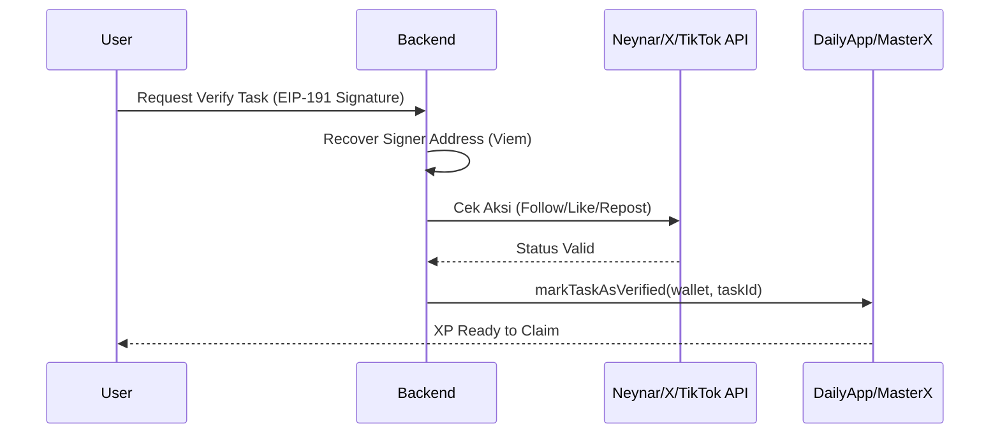
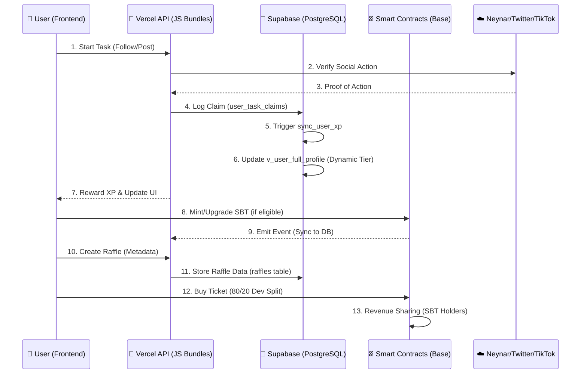

# 🪩 Product Requirements Document: Crypto Disco Application
**Version: 3.3.3 — Social Reliability & UX Edition**
**Tanggal**: 2026-03-13
**Status**: Active — Base Sepolia (Testnet) ✅ | Base Mainnet (Launch Ready)
**Author**: Antigravity (Ecosystem Sentinel)

> **Catatan**: Dokumen ini adalah gabungan lengkap dari v3.1, v3.2, DISCO_DAILY_MASTER_PRD.md, dan semua perubahan terbaru (v3.3). Versi lama diarsipkan dan dokumen ini menjadi **satu-satunya sumber kebenaran PRD**.

---

## 📋 Changelog

| Versi | Tanggal | Ringkasan |
|---|---|---|
| **3.3.3** | 2026-03-13 | **Social Reliability Upgrade**: Iterative pagination (500 items) for Twitter & Farcaster verification. **UX Fix**: Interactive "Link Google/X" buttons on Profile Page. **Bridge Verification**: Formalized TikTok/Instagram as bridge verifs with Identity Lock. |
| 3.3.1 | 2026-03-13 | X+Google OAuth identity linking (wallet-first 3-step onboarding). Bug Fix: `handleUpdateProfile` silent data loss. `v_user_full_profile` view extended. |
| 3.3 | 2026-03-13 | Unified master PRD. Menambahkan Audit-First Protocol, Zero-Hardcode Mandate, Multi-Model Agent Architecture (GEMINI.md, CLAUDE.md), Webhook Telegram Protocol, dan ProfilePage ReferenceError fix. |
| 3.2 | 2026-03-12 | UGC Raffle metadata, XP multi-level awarding, DB Security Invoker, Admin Dashboard controls (Lurah Hub). |
| 3.1 | 2026-03-11 | Zero-Leak Security, Pre-Flight Deployment Protocol, Git Hygiene Mandate gitleaks. |
| 3.0 | 2026-03-10 | Dual Network (Base Sepolia + Mainnet), Revenue Sharing (Dividends), UGC Mission Hub. |

---

## 1. Visi & Ekonomi Ekosistem

Crypto Disco adalah ekosistem gamifikasi Web3 di jaringan **Base** yang dirancang untuk retensi user harian melalui mekanisme Gacha, Misi Sosial, dan Ekonomi Sponsor. Sistem ini mengadopsi model **Revenue-Backing**, di mana pendapatan protokol (dari Raffle & Sponsorship) dibagikan kembali kepada pemegang **Soulbound Token (SBT)**.

### Core Value Proposition
- **Proof of Action**: Multi-platform social verification (Farcaster, Twitter, TikTok, Instagram).
- **Economic Loop**: Platform revenues (fees/sponsorships) are shared back with the community via SBT tiers.
- **Identity & Reputation**: Soulbound Token (SBT) NFTs that evolve based on activity (XP) and verified personhood.

---

## 2. Arsitektur & Technical Stack

### 2.1 Technical Architecture (Hybrid Decentralized)
- **Frontend**: React + Vite + Wagmi + RainbowKit + Viem (Web3).
- **Backend**: Vercel Serverless Functions (Node.js) — **Strict limit: < 12 functions**, bundled ke `*-bundle.js`.
- **Database**: Supabase (PostgreSQL) — Indexer & Social State, dengan RLS (Row Level Security) aktif.
- **Smart Contracts**: Base Mainnet & Sepolia (DailyAppV13, CryptoDiscoMaster, RaffleV2).
- **Agent AI**: Antigravity (Gemini) sebagai Lead Orchestrator, dengan sub-agents OpenClaw, Qwen, DeepSeek.

### 2.2 Smart Contract Addresses

| Contract | Base Mainnet (8453) | Base Sepolia (84532) | Env Key |
|---|---|---|---|
| **DailyApp V13** | `0x87a3d1203Bf20E7dF5659A819ED79a67b236F571` | `0x7A85f4150823d79ff51982c39C0b09048EA6cba3` | `VITE_V12_CONTRACT_ADDRESS` |
| **MasterX (XP)** | `[RESERVED]` | `0x474126AD2E111d4286d75C598bCf1B1e1461E71A` | `VITE_MASTER_X_ADDRESS` |
| **Raffle V2** | `[RESERVED]` | `0x92E8e19f77947E25664Ce42Ec9C4AD0b161Ed8D0` | `VITE_RAFFLE_ADDRESS` |
| **CMS V2** | `[RESERVED]` | `0xd992f0c869E82EC3B6779038Aa4fCE5F16305edC` | `VITE_CMS_CONTRACT_ADDRESS` |

### 2.3 End-to-End User Workflow
1. **Onboarding**: Connect Wallet → Sign SIWE Message → Sync Profile (Backend).
2. **Earn**: Selesaikan Daily Tasks (Sosial/On-chain) → Dapatkan XP (Synced via Verifier API).
3. **Ascend**: Capai XP Threshold → Bayar Gas/Fee → Upgrade SBT Tier (Soulbound).
4. **Yield**: Miliki SBT → Terima Dividen otomatis dari Pool Revenue → Claim ETH (Dividend Claim).
5. **Participate**: Beli tiket Raffle atau buat misi UGC sendiri sebagai sponsor.

---

## 3. API Bundles & Routing (Vercel Core)

API bertindak sebagai **"Trust Bridge"** antara Blockchain dan UI. Semua endpoint wajib EIP-191 Signature Verification.

| Bundle | Fungsi Utama |
|---|---|
| **`user-bundle.js`** | Login sync, XP sync, UGC Mission creation, SBT upgrade, Referral bonus, Pool Claim |
| **`tasks-bundle.js`** | Social task verification (Farcaster/Twitter/TikTok/Instagram), XP granting |
| **`admin-bundle.js`** | Lurah Hub commands, contract config, role management |
| **`audit-bundle.js`** | Ecosystem health checks, event sync, automated cron |
| **`raffle-bundle.js`** | UGC Raffle state, prize claim, winner tracking |

### 3.1 Verification Flow (Social Verifier)


---

## 4. Database Configuration & Schema

### 4.1 Tabel Inti
| Tabel | Fungsi |
|---|---|
| **`user_profiles`** | Master data user (XP, Tier, FID, Wallet, Sosial handles) |
| **`daily_tasks`** | List misi sosial (Quick, Batch, UGC). Kolom: `is_active`, `xp_reward`, `platform` |
| **`user_task_claims`** | Ledger klaim task — sumber kebenaran XP per-task |
| **`user_activity_logs`** | Transaction history lengkap (XP, Purchase, Reward) |
| **`point_settings`** | **Zero-Hardcode source**: semua nilai XP per action-type & platform |
| **`system_settings`** | **Zero-Hardcode source**: fee %, threshold, platform parameters |
| **`agent_vault`** | AI knowledge base (protokol, skills, state multi-agent) |
| **`raffles`** | UGC Raffle metadata, status, prize pool |

### 4.2 Database Functions & Triggers
- **`v_user_full_profile` (View — SECURITY INVOKER)**: Menghitung ranking dinamis via `PERCENT_RANK()` untuk tier (Diamond Top 1%, Platinum Top 5%, dst).
- **`trg_sync_xp_on_claim` (Trigger)**: Otomatis rekalkukasi `total_xp` user setiap ada klaim baru.
- **`sync_user_xp` (Function)**: Sinkronisasi XP dengan fixed search_path (anti mutable search_path vulnerability).
- **`fn_get_leaderboard` (Function)**: Leaderboard dengan fixed search_path.

### 4.3 Integrated Ecosystem Flow


---

## 5. Frontend Pages & Features

### 5.1 Halaman Utama
| Halaman | Fungsi |
|---|---|
| **🏠 HomePage** | Activity feed, daily bonus hub, quick quest access |
| **🎯 TasksPage** | Social quests hub (Farcaster/Twitter/TikTok/Instagram) + verification feedback |
| **🎟️ RafflesPage** | Gallery UGC raffles dengan status filters (Active/Ended) |
| **➕ CreateRafflePage** | Rich form UGC Raffle dengan live preview & metadata encoding (base64) |
| **📊 LeaderboardPage** | Global dan Tier-based ranking (XP, Raffle Wins, dynamic Rank Names) |
| **👤 ProfilePage** | User dashboard: Stats, NFT Tiers, Activity History, Daily Claim, Revenue Share |
| **📢 CampaignsPage** | Partner quests dan special event discovery |
| **🔐 LoginPage** | Wallet-First 3-Step Onboarding: Connect Wallet → Sign SIWE → Link Social Identity (optional) |
| **🔗 OAuthCallbackPage** | Popup bridge: menerima token dari Supabase OAuth redirect, postMessage ke opener |

### 5.2 Profile Page — Komponen Utama
- **DailyClaimModal**: Modal klaim bonus harian. `profileData` dipass sebagai prop.
- **Revenue Share Dashboard**: Tampilkan balance ETH claimable dari SBT Dividends.
- **Activity Log Section**: Riwayat XP/purchase real-time dari `user_activity_logs`.
- **UGC Mission Creator**: Form create sponsorship mission, fee & reward dari `system_settings` (Zero Hardcode).
- **Social Identity Linking (v3.3.3)**: Interactive buttons for Google/X/Farcaster. "Link Google" (Active) -> "Google Linked" (Locked).

### 5.3 Fitur Ekonomi
| Fitur | Mekanisme |
|---|---|
| **Daily Claim** | Klaim 100 XP/hari (nilai dari `point_settings.daily_claim`) |
| **Referral** | XP reward dari `point_settings` saat user baru join dengan ref link |
| **UGC Mission** | Platform fee & task XP dari `system_settings` / `point_settings` |
| **UGC Raffle** | Platform fee % & creator XP dari `system_settings` (Zero Hardcode) |
| **Revenue Share** | Dividen dari 30% revenue protokol, tier-weighted (Diamond x10 … Bronze x1) |
| **Underdog Bonus** | +10% XP untuk user Bronze/Silver yang aktif dalam 48 jam |

---

## 6. Admin Control Center (Lurah Hub)

Accessible via `/admin`. 19 modul kontrol ekonomi:

| Modul | Fungsi |
|---|---|
| **PoolTab** | Distribusi manual revenue ke holder SBT |
| **NFTConfigTab** | Ubah harga minting & XP threshold tanpa redeploy |
| **SyncLogTab** | Monitoring real-time kegagalan transaksi/sync |
| **RaffleManagerTab** | Moderasi raffle, adjust fees, monitor prize distribution |
| **RoleManagementTab** | Grant/Revoke ADMIN_ROLE & VERIFIER_ROLE |
| **BlockchainConfigTab** | Live update contract addresses & RPC endpoints |
| **SystemSettingsTab** | Adjust global parameters (tier_percentiles, XP, cooldowns) |
| **TaskManagerTab** | CRUD task harian, set XP reward dinamis |
| **RevenueTab** | Real-time ETH/USDC balance monitoring semua contract |

---

## 7. Agent AI Architecture (v3.3 — NEW)

### 7.1 Multi-Model Protocol
Semua model AI yang bekerja di project ini diwajibkan membaca protokol sebelum mulai kerja.

| File | Dibaca Oleh | Isi |
|---|---|---|
| `.cursorrules` | **Semua model di Cursor** (GPT, Claude, Gemini, DeepSeek, Qwen) | Master Architect Protocol + MANDATORY FIRST ACTION (baca 8 skill files sebelum kerja) |
| `.gemini/GEMINI.md` | **Gemini** native | Absolute Laws + Fix Cycle ringkas |
| `CLAUDE.md` | **Claude** (Sonnet/Opus/Haiku) native | Absolute Laws + Fix Cycle ringkas |
| `.agents/gemini.md` | **Antigravity** manual detail | Operational protocol lengkap |
| `agent_vault` (Supabase) | **Lurah Telegram Bot** | Cloud backup semua protokol |

### 7.2 Agent Skills (WAJIB dibaca urut)
```
CORE (selalu):
1. .agents/skills/ecosystem-sentinel/SKILL.md
2. .agents/skills/secure-infrastructure-manager/SKILL.md
3. .agents/skills/git-hygiene/SKILL.md

SITUATIONAL (jika relevan):
4. .agents/skills/raffle-integration/SKILL.md
5. .agents/skills/xp-reward-lifecycle/SKILL.md
6. .agents/skills/economy-profitability-manager/SKILL.md
7. .agents/skills/supabase-audit/SKILL.md
8. .agents/skills/admin-stability/SKILL.md
```

### 7.3 Audit-First Error Fix Protocol (Section 29 .cursorrules)
```
ERROR REPORTED
  → STEP 1: node scripts/check_sync_status.cjs   ← PRE-FIX AUDIT
  → STEP 2: grep_search + view_file              ← ROOT CAUSE ANALYSIS
  → STEP 3: Implement fix (Zero-Hardcode + Zero-Trust)
  → STEP 4: node scripts/check_sync_status.cjs   ← RE-AUDIT (wajib PASS sebelum notify user)
```

---

## 8. Webhooks & Integrations

| Integrasi | Fungsi |
|---|---|
| **Neynar** | Farcaster identity bridge (FID ↔ Wallet), social action proof |
| **X (Twitter) API** | Follow/Like/Retweet verification |
| **TikTok / Instagram** | Follow/Like verification (wildcard matching) |
| **Telegram Bot** | `verification-server/api/webhook/telegram.js` — Admin remote control via Lurah Ekosistem |
| **DexScreener** | Real-time token price oracle untuk estimasi hadiah dalam USD |
| **Vercel Cron** | Scheduled sync, daily task reset (07:00 WIB), event indexing |

### 8.1 Telegram Bot (Lurah Ekosistem) Commands
| Command | Fungsi |
|---|---|
| `/audit` | Trigger ecosystem audit instan |
| `/user <wallet>` | Full Social Identity Lock audit |
| `/stats` | Statistik user, XP, pertumbuhan |
| `/health` | Cek koneksi DB & RPC |
| `/daftar_task` | List & hapus task harian |
| `/tambah_task Desc \| Link` | Buat task baru (XP dari `point_settings` — Zero Hardcode) |
| `/fix <error>` | AI-powered error analysis via Gemini |
| `/model` | Ganti model AI Lurah (Flash/Pro) |

---

## 9. Security & Audit Mandates

### 9.1 Zero-Hardcode Mandate (CRITICAL)
- **DEFINISI**: Semua nilai XP, Fee, Reward, Threshold **DILARANG** hardcode di source code.
- **SUMBER**: Semua parameter wajib dari `point_settings` atau `system_settings` di Supabase.
- **AUDIT**: `grep -rn "|| [0-9]" api/ src/` sebelum setiap push.

### 9.2 Zero-Trust Security
- **EIP-191 Signature**: Semua API backend yang modify data wajib validasi signature wallet.
- **Replay Protection**: Timestamp window validasi maksimal 5 menit.
- **Social Identity Lock**: 1 platform (Twitter/Farcaster/TikTok/Instagram) = 1 wallet. Anti-Sybil.
- **Service Role Key**: HANYA digunakan di server-side. Dilarang di `src/` (frontend).

### 9.3 Pre-Push Checklist (WAJIB)
```bash
node scripts/check_sync_status.cjs   # Ecosystem sync audit
node -c api/user-bundle.js           # Syntax check
node -c api/admin-bundle.js
npm run gitleaks-check               # Secret leak scan
npm run lint                         # Frontend linter
npm run build                        # Build test
git status                           # Clean tree check
```

### 9.4 Git Hygiene (Clean Tree Mandate)
**NEVER COMMIT**: `.env*`, `tmp_*.cjs`, `_archive/`, `*.log`, `FlatCryptoDisco*.sol`, `test-env/`, `.gemini/`, `.cursorrules`

**ALWAYS TRACK**: `contracts/`, `api/`, `src/`, `scripts/`, `.agents/skills/`, `CLAUDE.md`

---

## 10. Tiering System

| Tier | Level | XP Threshold | Multiplier | Dividen Weight |
|---|---|---|---|---|
| **Rookie** | 0 | 0 XP | 1.00x | — |
| **Bronze** | 1 | 500 XP | 1.10x | ×1 |
| **Silver** | 2 | 2,000 XP | 1.20x | ×2 |
| **Gold** | 3 | 5,000 XP | 1.30x | ×3 |
| **Platinum** | 4 | Top 5% | 1.40x | ×5 |
| **Diamond** | 5 | Top 1% | 1.50x | ×10 |

**Hard cap**: Diamond SBT Multiplier DILARANG melebihi 1.5x (15000 BP) di contract manapun.

---

## 11. Revenue Flow

```
Platform Revenue (Raffle Fee + Sponsorship Fee)
    │
    ├── 70% → Operations & Development
    └── 30% → SBT Community Dividend Pool
                │
                └── Distributed weighted by tier
                    Diamond (×10) > Platinum (×5) > Gold (×3) > Silver (×2) > Bronze (×1)

UGC Raffle Split:
    Total Prize Pool
    ├── 80% → Prize Pool (to winners)
    └── 20% → Platform (→ 30% back to SBT holders)
```

---

## 12. Ecosystem Verification Status

| Module | Status | Core Logic |
|---|---|---|
| **Auth** | 🟢 100% | SIWE + Identity Lock + Wallet-First OAuth linking |
| **XP Logic** | 🟢 100% | Dynamic from `point_settings`, on-chain sync |
| **Dividends** | 🟢 100% | Weighted Share (10%–30%), tier-based |
| **UGC Hub** | 🟢 100% | Auto-sync to Global Tasks |
| **Raffle** | 🟢 100% | ERC721 + metadata base64, prize tracking (500 ReferenceError fixed) |
| **Admin Bot** | 🟢 100% | Telegram Lurah, AI-powered `/fix` |
| **Zero Hardcode** | 🟢 100% | All XP/Fee from Supabase settings |
| **Audit Protocol** | 🟢 100% | Pre-Fix & Post-Fix audit mandatory |
| **Multi-Model AI** | 🟢 100% | GEMINI.md + CLAUDE.md + .cursorrules |
| **Social Platforms** | 🟢 100% | Twitter & Farcaster (Iterative 500 items), TikTok & Instagram (Bridge) |
| **OAuth (Google/X)** | 🟢 100% | Wallet-first 3-step + **Profile Page Interactive Linking (v3.3.3)** |
| **DB Performance** | 🟢 100% | Duplicate index/RLS cleaned, FK indexes added, initplan optimized |

---

*PRD Version: 3.3.3 — Social Reliability + Profile UX Edition*
*Berdasarkan protokol Full-Stack Sync. Ecosystem Synced. Identity Locked. Zero Hardcode. Audit-First. Lurah Approved.*
