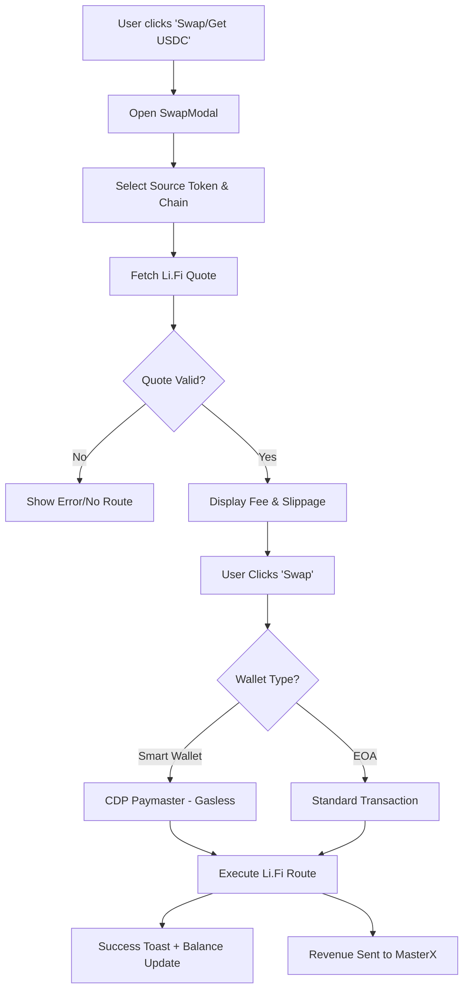

# PRD: Swap & Profit Engine (v3.47.0)

## 1. Overview
The Swap & Profit Engine is a strategic feature designed to onboard users who lack ETH/USDC on the Base network and to generate a sustainable revenue stream (Integrator Fees) for the Crypto Disco protocol. By integrating Li.Fi, we enable cross-chain bridging and single-chain swaps directly within the application.

## 2. Objectives
- **User Growth**: Allow users from other chains (Mainnet, OP, ARB, etc.) to onboard with a single transaction.
- **Revenue Generation**: Collect a **0.5% - 1.0%** fee on every swap/bridge volume.
- **Frictionless UX**: Support gasless swap intents via Coinbase Smart Wallet & CDP Paymaster.

## 3. Features & Functions
### 3.1. Unified Swap Modal
- **Source Token Selection**: Detect and list all tokens in user's wallet across supported chains.
- **Destination Token**: Hardcoded options for ETH (Base) and USDC (Base).
- **Real-time Quotes**: Fetch best routes using Li.Fi API.
- **Slippage Protection**: User-configurable slippage (default 0.5%).

### 3.2. Profit Mechanism
- **Integrator Fee**: 0.5% (Configurable up to 1.0%).
- **Fee Recipient**: `MASTER_X_ADDRESS` (0x980770dAcE8f13E10632D3EC1410FAA4c707076c).
- **Deduction**: Automatic deduction by Li.Fi contract during the swap.

### 3.3. Gasless Support (CDP Paymaster)
- If user is using a **Smart Wallet**, the swap transaction will be wrapped to use the CDP Paymaster.
- Users with 0 ETH can swap existing ERC20 tokens into ETH for future gas.

---

# Workflow: Swap Integration

---

# Step-by-Step List To-Do (v3.47.0)

- [x] **Phase 1: Environment & Setup**
    - [x] Add `VITE_LIFI_INTEGRATOR_ID` to `.env`.
    - [x] Verify `MASTER_X_ADDRESS` is correctly set as fee recipient.
- [x] **Phase 2: Component Development**
    - [x] Install `@lifi/widget` and `@lifi/sdk`.
    - [x] Create `SwapModal.jsx` with "Midnight Cyber" styling.
    - [x] Integrate Li.Fi Widget with custom theme and partner fee.
- [x] **Phase 3: Logic & Integration**
    - [x] *PIVOT*: Replaced `@lifi/widget` with `@lifi/sdk` custom UI due to Rollup AST build crash.
    - [x] Hook `SwapModal` into `ProfilePage.jsx` and `RaffleCard.jsx`.
    - [x] Implement "GET USDC" buttons as balance support.
    - [x] Finalize auto-trigger on insufficient balance for Task creation.
- [/] **Phase 4: Verification & Audit**
    - [x] Test swap route on Base Sepolia.
    - [x] Verify UI/UX audit for "Native+" compliance.
    - [x] Systematic Documentation Sync (v3.47.0).
