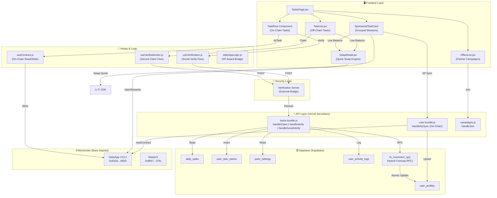
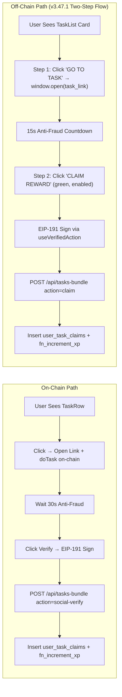
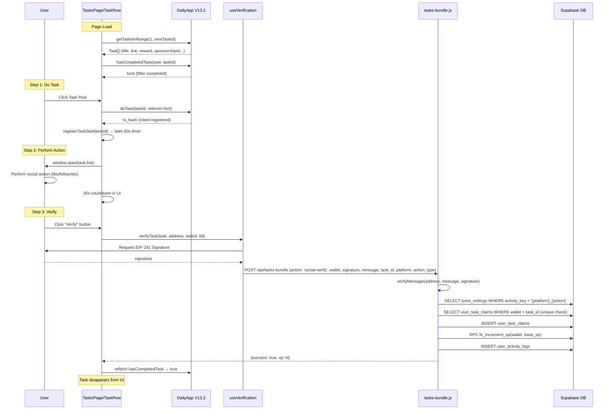
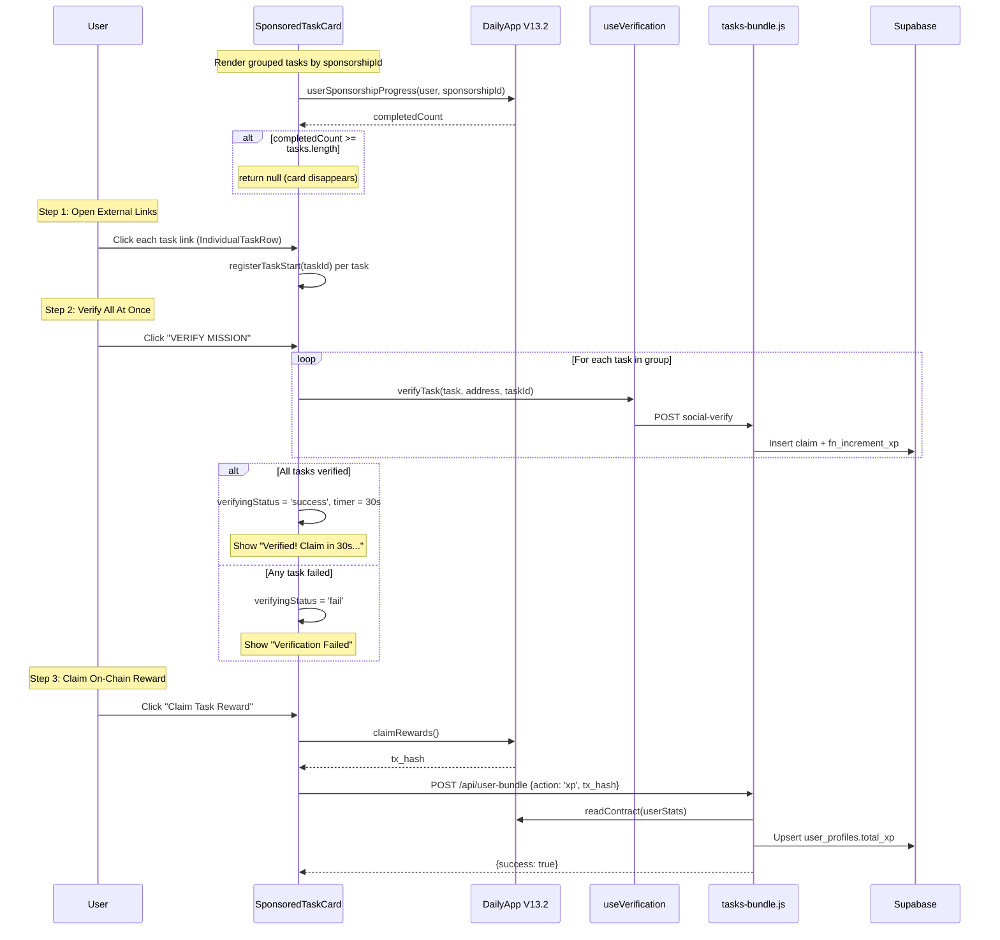
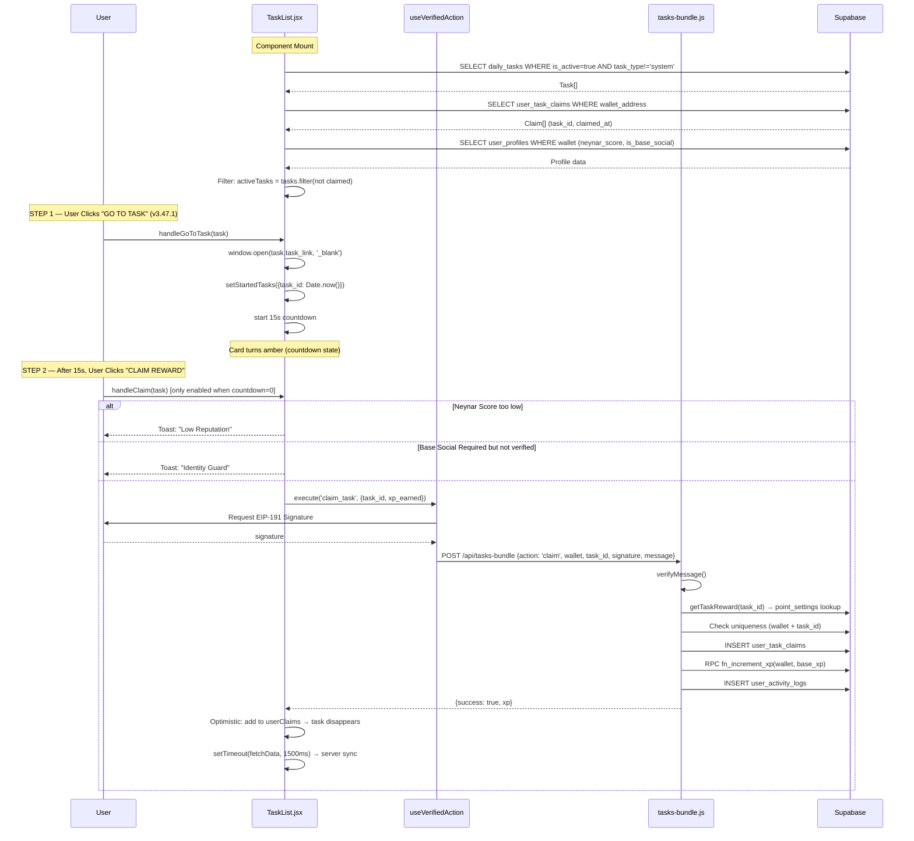
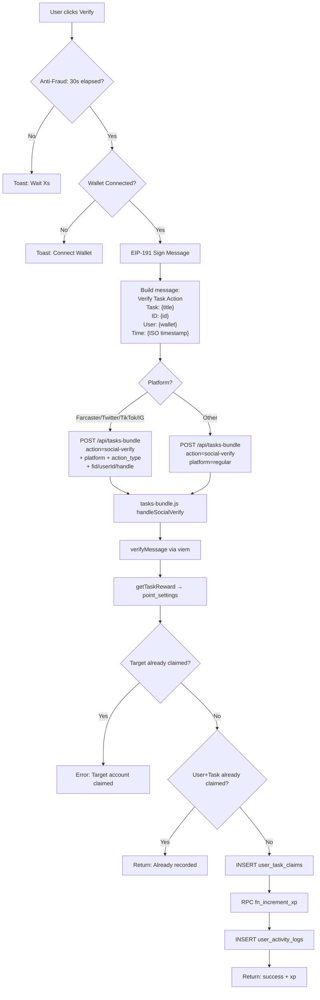
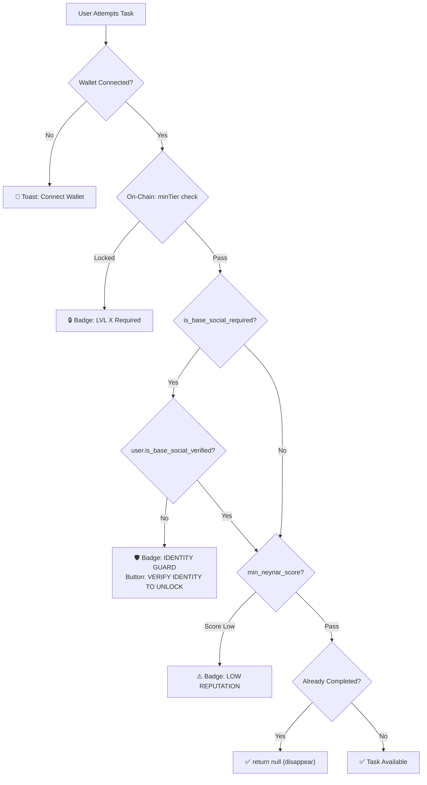

# 🎯 TASK FEATURE WORKFLOW — COMPLETE END-TO-END TECHNICAL DOCUMENT
**Version**: `v3.59.0` | **Last Updated**: `2026-05-06T18:00:00+07:00`
**Status**: 🛡️ PRODUCTION-GRADE SOURCE OF TRUTH

---

### 📜 Changelog
- **v3.59.0**: Ecosystem Infrastructure Hardening & Zero-Hardcode Sync. Refactor `abis_data.txt` untuk menghapus alamat statis, pemulihan webhook Telegram Lurah Bot, dan sinkronisasi environment global.
- **v3.58.0**: Lurah Ecosystem Hardening & Autonomous Agent Resiliency. Implementasi **Auto-Retry logic** pada RPC, heartbeat dinamis di `system_health`, dan eliminasi hardcoded addresses.
- **v3.57.0**: Hardening UGC Mission Pipeline. Implementasi **Multi-Action Campaign selector**, **All-or-Nothing Reward Claiming**, dan **Grouped UI Components** (`UGCCampaignCard`). Validasi URL platform-aware.
- **v3.56.4**: Hardened Multi-Agent Cognitive Sync. Implementasi **Lurah Brain (AI Filter)**, **Telegram Chat Memory**, dan **Sequential SBT Upgrade Mandate**. Penghapusan protokol "Izin Pemeliharaan" untuk agen otonom.
- **v3.56.3**: Implementasi Raffle v2.1 Refund Protocol & OpenClaw Security Audit.

---

## 📋 Table of Contents
1. [Arsitektur Tingkat Tinggi](#1-arsitektur-tingkat-tinggi)
2. [Dua Jalur Tugas (Dual Task Pipeline)](#2-dua-jalur-tugas)
3. [Smart Contract Registry & Functions](#3-smart-contract-registry--functions)
4. [Database Schema (Supabase)](#4-database-schema-supabase)
5. [API Routing & Bundle Map](#5-api-routing--bundle-map)
6. [On-Chain Task Workflow (E2E)](#6-on-chain-task-workflow-e2e)
7. [Off-Chain Task Workflow (E2E)](#7-off-chain-task-workflow-e2e)
8. [Social Verification Flow](#8-social-verification-flow)
9. [XP Economy & Hybrid Formula](#9-xp-economy--hybrid-formula)
10. [Identity Guard & Access Control](#10-identity-guard--access-control)
11. [Disappearing Task Mandate](#11-disappearing-task-mandate)
12. [Partner Offers (Campaigns)](#12-partner-offers-campaigns)
13. [Admin Task Management](#13-admin-task-management)
14. [File Reference Map](#14-file-reference-map)
15. [Healthy State Checklist](#15-healthy-state-checklist)
16. [Self-Healing Claim Pipeline](#16-self-healing-claim-pipeline)
17. [Concurrent UI Performance](#17-concurrent-ui-performance)
18. [SBT Tier Integration Mandate](#18-sbt-tier-integration-mandate)
19. [UGC Multi-Action & All-or-Nothing Campaign Workflow](#19-ugc-multi-action--all-or-nothing-campaign-workflow)
20. [Zero-Hardcode Infrastructure Mandate](#20-zero-hardcode-infrastructure-mandate)

---

## 1. Arsitektur Tingkat Tinggi

Fitur Task adalah inti dari engagement loop Crypto Disco. User menyelesaikan tugas (sosial, on-chain, atau harian) dan mendapatkan XP yang menggerakkan seluruh ekonomi tier dan reward.



---

## 2. Dua Jalur Tugas

> [!IMPORTANT]
> Crypto Disco memiliki **DUA jalur tugas yang sangat berbeda**. Agen dan developer WAJIB memahami perbedaan ini untuk mencegah bug XP sync.

| Aspek | 🟦 On-Chain Tasks | 🟩 Off-Chain Tasks |
|---|---|---|
| **Sumber Data** | Smart Contract `DailyApp V13.2` | Tabel Supabase `daily_tasks` |
| **Penyimpanan Tugas** | Disimpan on-chain via `addTask()` | Disimpan di database via Admin |
| **Komponen UI** | `TaskRow` di `TasksPage.jsx` | `TaskList.jsx` (standalone) |
| **Verifikasi Sosial** | Ya — via `useVerification.js` | Tidak — klaim langsung |
| **Pemeriksaan Selesai** | `hasCompletedTask(user, taskId)` on-chain | `user_task_claims` lookup di DB |
| **Klaim XP** | `doTask()` → `awardTaskXP()` → `/api/tasks/verify` | `useVerifiedAction` → `/api/tasks-bundle?action=claim` |
| **XP Sync Method** | `fn_increment_xp` via tasks-bundle | `fn_increment_xp` via tasks-bundle |
| **Reward Source** | `point_settings` (dynamic key) | `point_settings` → fallback `daily_tasks.xp_reward` |
| **Sponsored Grouping** | Ya — `sponsorshipId` grouping | Tidak |
| **Tier Gating** | Ya — `minTier` on-chain | Tidak secara langsung |
| **Identity Guard** | Ya — `isBaseSocialRequired` | Ya — `is_base_social_required` column |
| **Unique Constraint** | `hasCompletedTask` (on-chain boolean) | `user_task_claims` UNIQUE(wallet, task_id) |



---

## 3. Smart Contract Registry & Functions

### 3.1 Contract Addresses (Base Sepolia — 84532)

| Contract | Address | Governance |
|---|---|---|
| **DailyApp V13.2** | `0x81D65Cc9267e2eBF88D079e3598Ec78f48aE4B5D` | `AccessControl` |
| **MasterX (XP)** | `0x980770dAcE8f13E10632D3EC1410FAA4c707076c` | `Ownable` |
| **Raffle** | `0xE7CB85c307f1c368DCB9FFcfa5f3e02324eaf1f3` | `Ownable` |
| **CMS V2** | `0xd992f0c869E82EC3B6779038Aa4fCE5F16305edC` | `AccessControl` |

> [!WARNING]
> Mainnet addresses are `[RESERVED]` — NEVER use Sepolia addresses on Mainnet labels.

### 3.2 DailyApp V13.2 — Task-Related Functions

| Function | Type | Signature | Purpose |
|---|---|---|---|
| `getTask` | `view` | `(uint256 taskId) → (baseReward, isActive, cooldown, minTier, title, link, createdAt, requiresVerification, sponsorshipId)` | Membaca detail tugas |
| `getTasksInRange` | `view` | `(uint256 from, uint256 to) → Task[]` | Batch baca seluruh tugas |
| `nextTaskId` | `view` | `() → uint256` | Total tugas yang terdaftar |
| `doTask` | `write` | `(uint256 taskId, address referrer)` | Registrasi intent/cooldown user |
| `hasCompletedTask` | `view` | `(address user, uint256 taskId) → bool` | Cek apakah tugas sudah selesai |
| `isTaskVerified` | `view` | `(address user, uint256 taskId) → bool` | Cek status verifikasi |
| `userStats` | `view` | `(address user) → (points, totalTasksCompleted, referralCount, currentTier, tasksForReferralProgress, lastDailyBonusClaim, isBlacklisted)` | Statistik user |
| `userSponsorshipProgress` | `view` | `(address user, uint256 sponsorshipId) → uint256 count` | Progress sponsorship mission |
| `claimableRewards` | `view` | `(address user) → uint256` | Reward yang bisa diklaim |
| `claimRewards` | `write` | `()` | Klaim akumulasi reward |
| `lastActivityTime` | `view` | `(address user) → uint256` | Timestamp aktivitas terakhir |
| `addTask` | `write` | `(baseReward, isActive, cooldown, minTier, title, link, requiresVerification, sponsorshipId)` | Admin: Tambah tugas |
| `setSponsorshipParams` | `write` | `(rewardPerClaim, tasksRequired, minPool, platformFee)` | Admin: Config sponsorship parameters |
| `setTokenPriceUSD` | `write` | `(uint256 newPrice)` | Admin: Direct update token price |
| `approveSponsorship` | `write` | `(uint256 requestId)` | Admin: Setujui sponsorship |
| `rejectSponsorship` | `write` | `(uint256 requestId, string reason)` | Admin: Tolak sponsorship |
| `buySponsorshipWithToken` | `write` | `(sponsorshipId, titles[], links[], email, rewardPerClaim, paymentToken)` | Sponsor: Buy sponsorship mission |

### 3.3 ABI Source of Truth

```
File: src/lib/abis_data.txt
Import: src/lib/contracts.js (Proxy pattern — anti Rollup AST crash)
```

ABIs di-load secara lazy via `createAbiProxy()` pattern:
```javascript
// contracts.js
export const DAILY_APP_ABI = createAbiProxy('DAILY_APP');
export const CONTRACTS = {
    DAILY_APP: getAddr('DAILY_APP', 'VITE_V12_CONTRACT_ADDRESS', 'VITE_V12_CONTRACT_ADDRESS_SEPOLIA'),
    // ...
};
```

---

## 4. Database Schema (Supabase)

### 4.1 `daily_tasks` — Off-Chain Task Definitions

| Column | Type | Description |
|---|---|---|
| `id` | `uuid` (PK) | ID unik tugas |
| `title` | `text` | Judul tugas (ditampilkan di UI) |
| `description` | `text` | Deskripsi lengkap |
| `platform` | `text` | Platform sosial: `farcaster`, `twitter`, `tiktok`, `instagram`, `regular` |
| `action_type` | `text` | Jenis aksi: `follow`, `like`, `repost`, `comment`, `task` |
| `xp_reward` | `integer` | Base XP reward (fallback jika `point_settings` tidak ada) |
| `target_id` | `text` | ID target sosial (FID, tweet ID, etc.) — Sybil prevention |
| `task_type` | `text` | `social`, `regular`, `system` — Sistem tasks difilter dari UI |
| `is_active` | `boolean` | Status aktif (UGC default: `false` sampai admin approve) |
| `is_base_social_required` | `boolean` | Apakah memerlukan Basenames identity verification |
| `min_neynar_score` | `integer` | Minimum Neynar reputation score (anti-Sybil) |
| `expires_at` | `timestamp` | Tanggal kadaluarsa (null = permanent) |
| `created_at` | `timestamp` | Tanggal dibuat |

### 4.2 `user_task_claims` — Claim History (One-Time Per Task)

| Column | Type | Description |
|---|---|---|
| `id` | `uuid` (PK) | Auto-generated |
| `wallet_address` | `text` | User wallet (lowercase) |
| `task_id` | `text` | Reference ke `daily_tasks.id` atau dynamic ID (e.g., `raffle_buy_123`) |
| `platform` | `text` | Platform verifikasi |
| `action_type` | `text` | Jenis aksi |
| `xp_earned` | `integer` | XP yang diberikan (sebelum scaling) |
| `target_id` | `text` | Target ID untuk Sybil prevention |
| `claimed_at` | `timestamp` | Waktu klaim |
| **UNIQUE** | | `(wallet_address, task_id)` — Mencegah duplikasi |

### 4.3 `point_settings` — Dynamic XP Configuration (Zero-Hardcode)

| Column | Type | Description |
|---|---|---|
| `id` | `uuid` (PK) | Auto-generated |
| `activity_key` | `text` (UNIQUE) | Pattern: `{platform}_{action_type}` (e.g., `farcaster_follow`) |
| `points_value` | `integer` | Base XP value |
| `is_active` | `boolean` | Aktif/non-aktif |

**Canonical Keys**:
`daily_claim` · `farcaster_follow` · `farcaster_like` · `farcaster_recast` · `x_follow` · `x_repost` · `x_like` · `base_transaction` · `raffle_buy` · `raffle_win` · `raffle_ticket` · `sponsor_task`

### 4.4 `user_profiles` — Core User Identity

| Column | Type | Task-Related |
|---|---|---|
| `wallet_address` | `text` (PK) | ✅ Join key untuk claims |
| `total_xp` | `integer` | ✅ Updated via `fn_increment_xp` setelah klaim |
| `tier` | `integer` | ✅ Tier gating untuk tugas |
| `is_base_social_verified` | `boolean` | ✅ Identity guard |
| `neynar_score` | `integer` | ✅ Reputation gating |
| `referred_by` | `text` | ✅ Referral dividend tracking |
| `referral_bonus_paid` | `boolean` | ✅ 500 XP milestone vesting |
| `last_seen_at` | `timestamp` | ✅ Leaderboard sync |

### 4.5 `user_activity_logs` — Audit Trail

| Column | Type | Description |
|---|---|---|
| `wallet_address` | `text` | User wallet |
| `category` | `text` | `XP`, `PURCHASE`, `REFERRAL_DIVIDEND` |
| `activity_type` | `text` | `Task Claim`, `Task Verify`, `Social Verify`, `Raffle Ticket Buy` |
| `description` | `text` | Human-readable description |
| `value_amount` | `integer` | XP amount |
| `value_symbol` | `text` | `XP` |
| `tx_hash` | `text` | Transaction hash (if applicable) |
| `metadata` | `jsonb` | Additional context |

### 4.6 `fn_increment_xp` — Atomic XP RPC Function

```sql
-- Signature
fn_increment_xp(p_wallet TEXT, p_amount INT) → void

-- Internal Logic (Hybrid Formula v3.41.2):
-- Final_XP = MAX(5, ROUND(Base_XP * G * I * U))
-- G = 1.5 / (1 + log10(total_users / 1000 + 1))     -- Global Multiplier
-- I = MAX(0.5, 1.0 - (user_xp / 20000))               -- Individual Anti-Whale
-- U = 1.1 if tier <= Silver, else 1.0                   -- Underdog Bonus
--
-- Also handles:
-- 1. Referral vesting (50 XP when invitee reaches 500 XP)
-- 2. 10% passive dividend to Tier 1 referrer
-- 3. Activity logging for REFERRAL_DIVIDEND
```

> [!CAUTION]
> DILARANG menghitung XP scaling di frontend atau backend JavaScript. Semua scaling wajib melalui `fn_increment_xp` di Postgres.

### 4.7 `v_user_full_profile` — Unified View

View SQL yang menggabungkan `user_profiles` dengan tier names, SBT stats, dan raffle statistics. Digunakan oleh Leaderboard dan profil user.

### 4.8 `telegram_chat_history` — Conversational Memory (v3.56.4)

| Column | Type | Description |
|---|---|---|
| `id` | `uuid` (PK) | Auto-generated |
| `chat_id` | `text` | ID Chat Telegram (Owner) |
| `role` | `text` | `user` (Owner) atau `assistant` (Lurah) |
| `content` | `text` | Isi pesan/diskusi teknis |
| `created_at` | `timestamp` | Waktu pesan dikirim |

> [!TIP]
> Digunakan oleh Lurah (Antigravity Bridge) untuk mempertahankan konteks diskusi teknis hingga 10 pesan terakhir tanpa kehilangan alur pikiran.

### 4.9 `nexus_agent_reports` — Intelligence Feed

Digunakan oleh **Lurah Brain** untuk memfilter laporan agen (Linter, Security, Sync) sebelum dikirim ke Telegram. Hanya laporan dengan level `CRITICAL` atau `ALERT` yang akan memicu notifikasi.

---

## 5. API Routing & Bundle Map

### 5.1 Vercel Rewrites (vercel.json)

| Frontend Path | Backend Target | Action |
|---|---|---|
| `POST /api/tasks-bundle` | `tasks-bundle.js` | Direct call (claim, verify, social-verify) |
| `/api/tasks/:action` | `tasks-bundle.js?action=:action` | Rewrite pattern |
| `/api/verify-action` | `tasks-bundle.js?action=social-verify` | Legacy alias |
| `POST /api/user-bundle` | `user-bundle.js` | XP sync (on-chain daily claim) |
| `POST /api/campaigns` | `campaigns.js` | Partner Offers join |
| `/api/admin/tasks/:action` | `admin-bundle.js?action=task-:action` | Admin task CRUD |

### 5.2 tasks-bundle.js — Handler Map

| Action | Handler Function | Trigger |
|---|---|---|
| `claim` | `handleClaim()` | Off-chain task klaim (TaskList.jsx) |
| `verify` | `handleVerify()` | On-chain task verify (TaskRow) |
| `social-verify` | `handleSocialVerify()` | Social task verify (useVerification.js) |

**Common Flow**:
```
1. Validate EIP-191 Signature (viem.verifyMessage)
2. Get XP reward from point_settings (dynamic) → fallback to daily_tasks.xp_reward
3. Check Sybil: target_id uniqueness + global task_id uniqueness
4. Insert into user_task_claims (UNIQUE constraint)
5. Call fn_increment_xp(wallet, base_xp) — scaling handled in DB
6. Log to user_activity_logs
7. Return { success: true, xp }
```

### 5.3 Feature Guard (Mainnet Phased Rollout)

```javascript
// tasks-bundle.js
if (['claim', 'verify'].includes(action)) {
    const allowed = await checkFeatureGuard('daily_claim', res);
    if (!allowed) return; // HTTP 403 on Mainnet if feature disabled
}
```

---

## 6. On-Chain Task Workflow (E2E)

### 6.1 Regular On-Chain Task



### 6.2 Sponsored Mission (Grouped Tasks)



---

## 7. Off-Chain Task Workflow (E2E)



---

## 8. Social Verification Flow

### 8.1 Verification Pipeline (useVerification.js)



### 8.2 Anti-Fraud Mechanisms

| Layer | Mechanism | Implementation |
|---|---|---|
| **30s Delay** | Mencegah instant verify tanpa aksi nyata | `lastActionTime[taskId]` + countdown di UI |
| **EIP-191 Signature** | Membuktikan kepemilikan wallet | `viem.verifyMessage()` di backend |
| **Timestamp Window** | Mencegah replay attack | Timestamp dalam signed message (5 min window) |
| **Target Uniqueness** | Mencegah multi-wallet claim per target | `target_id` check di `user_task_claims` |
| **Global Uniqueness** | Satu wallet = satu kali per task_id | UNIQUE constraint `(wallet, task_id)` |
| **Neynar Score Gate** | Reputasi minimum untuk tugas tertentu | `min_neynar_score` di `daily_tasks` |
| **Identity Guard** | Basenames verification untuk premium tasks | `is_base_social_required` flag |
| **Tier Gating** | Level minimum untuk on-chain tasks | `minTier` di smart contract |
| **Feature Guard** | Kill switch untuk Mainnet rollout | `system_settings.active_features` |

---

## 9. XP Economy & Hybrid Formula

### 9.1 The Nexus Hybrid Formula (v3.41.2)

```
Final_XP = MAX(5, ROUND(Base_XP × G × I × U))
```

| Variable | Formula | Range | Purpose |
|---|---|---|---|
| **G** (Global) | `1.5 / (1 + log₁₀(users/1000 + 1))` | ~0.75 – 1.5 | Anti-inflasi seiring pertumbuhan user |
| **I** (Individual) | `MAX(0.5, 1.0 - (xp/20000))` | 0.5 – 1.0 | Anti-whale; pemain lama dapat lebih sedikit |
| **U** (Underdog) | `1.1 if tier ≤ Silver` | 1.0 – 1.1 | +10% catch-up untuk tier rendah |
| **Floor** | `MAX(5, ...)` | ≥ 5 | Minimum reward terjamin |

### 9.2 XP Resolution Priority

```mermaid
flowchart TD
    Task[Task claimed] --> Type{Task ID Pattern?}

    Type -- "raffle_buy_*" --> PS1[point_settings WHERE activity_key = 'raffle_buy']
    Type -- "raffle_win_*" --> PS2[point_settings WHERE activity_key = 'raffle_win']
    Type -- "raffle_draw_*" --> PS3[point_settings WHERE activity_key = 'raffle_ticket']
    Type -- "UUID (Supabase)" --> DB1[daily_tasks → get platform + action_type]

    DB1 --> DynKey["Build key: {platform}_{action_type}"]
    DynKey --> PS4[point_settings WHERE activity_key = dynamic_key]
    PS4 --> Check{points_value > 0?}
    Check -- Yes --> Use[Use dynamic value]
    Check -- No --> Fallback[Use daily_tasks.xp_reward]

    PS1 & PS2 & PS3 & Use & Fallback --> FN[fn_increment_xp(wallet, base_xp)]
    FN --> Result[Hybrid Formula Applied in Postgres]
```

### 9.3 Referral Integration

Setiap XP yang masuk via `fn_increment_xp` otomatis:
1. **Milestone Check**: Jika `total_xp >= 500` dan `referral_bonus_paid = false`, berikan 50 XP ke referrer
2. **Passive Dividend**: Berikan 10% × `base_xp` ke Tier 1 referrer
3. **Logging**: Catat `REFERRAL_DIVIDEND` dan `REFERRAL_VESTING` di `user_activity_logs`

---

## 10. Identity Guard & Access Control

### 10.1 Access Control Matrix



### 10.2 Farcaster Account Check

Tugas berbasis Farcaster (`warpcast.com` or `farcaster` in link) memerlukan `profileData.fid`. Jika tidak ada, user diarahkan ke sign-up Farcaster via toast dengan referral link.

### 10.3 Base Social (Basenames) Verification

1. User mengunjungi Profil → Klik "LINK BASE SOCIAL"
2. Backend melakukan reverse resolution via on-chain resolver (`0xC697...`)
3. Jika Basename ditemukan: `user_profiles.is_base_social_verified = true`
4. Tugas dengan `is_base_social_required = true` menjadi terbuka

---

## 11. Disappearing Task Mandate (v3.42.2)

> [!IMPORTANT]
> Tugas yang sudah selesai/diklaim **WAJIB menghilang** dari UI. Tidak ada badge "DONE" yang tetap terlihat.

### 11.1 On-Chain Tasks (TaskRow)

```javascript
// TasksPage.jsx — TaskRow component
const { data: isCompleted } = useReadContract({
    functionName: 'hasCompletedTask',
    args: [address, taskId],
});

// CRITICAL: Early return null = task disappears
if (isLoading || !task || !task.isActive || isCompleted) return null;
```

### 11.2 Off-Chain Tasks (TaskList)

```javascript
// TaskList.jsx — Active task filter
const activeTasks = tasks.filter(task => {
    const history = userClaims.filter(c => String(c.task_id) === String(task.id));
    const hasAnyClaim = history.length > 0;
    if (hasAnyClaim) return false;       // ← DISAPPEAR
    if (task.task_type === 'system') return false;
    return true;
});
```

> [!WARNING]
> **Type-Safety**: SELALU gunakan `String()` conversion saat membandingkan task IDs. Contract IDs = Integer, Supabase IDs = UUID. `===` tanpa konversi akan gagal silently.

### 11.3 Sponsored Card Disappearance

```javascript
// SponsoredTaskCard
const isGlobalCompleted = progressCount >= tasks.length;
if (isGlobalCompleted) return null; // Entire card disappears
```

### 11.4 Reactive Error Sync (Race Condition Fix)

```javascript
// TaskList.jsx — handleClaim success/error handler
const result = await executeClaim('claim_task', { task_id, xp_earned });

// NEW (v3.42.8): Explicitly handle already_claimed flag from success response
if (result?.already_claimed) {
    toast.success("Mission already completed! Syncing...", { id: toastId });
} else {
    toast.success(`Claimed +${task.xp_reward} XP!`, { id: toastId });
}

// Force sync: add to local claims → task disappears instantly
setUserClaims(prev => [...prev, { task_id: task.id, claimed_at: new Date().toISOString() }]);
setTimeout(() => fetchData(), 1500); // Full server sync
```

### 11.5 Empty State

Ketika seluruh tugas selesai, tampilkan:
- **On-Chain**: `"YOU ARE ALL CAUGHT UP!"` banner dengan `CheckCircle2` icon
- **Off-Chain**: `"ALL MISSIONS COMPLETED"` dengan subtitle "Check back tomorrow"

---

## 12. Partner Offers (Campaigns)

### 12.1 Data Source

Tabel: `campaigns`
- Diambil langsung dari Supabase (READ via `supabase.from('campaigns')`)
- Filter: `status = 'active'`
- UI: `OffersList.jsx` → `CampaignCard` component

### 12.2 Join Flow

```
User → Click "JOIN MISSION" → EIP-191 Sign → POST /api/campaigns {action: 'join'}
→ Backend validates signature → Insert campaign_participants → Success
```

### 12.3 Campaigns vs Tasks

| Feature | Tasks | Campaigns |
|---|---|---|
| XP Reward | Yes | USDC/token reward per user |
| Verification | Social API check | Join participation |
| Duration | Permanent or expires_at | `start_at` → `end_at` window |
| Capacity | Unlimited claims | `max_participants` limit |
| UI Location | "Daily Tasks" tab | "Partner Offers" tab |

---

## 13. Admin Task Management

### 13.1 Off-Chain Task Management (v3.42.8)

Admin Dashboard → `TaskManagerTab` → Create/Sync Task.
Pipeline Backend (`admin-bundle.js`) sekarang memproses field berikut secara atomic:
- `title` & `description`: Keduanya di-set (sebelumnya hanya description).
- `xp_reward`: Poin dasar.
- `target_id`: ID unik sosial (FID/TweetID) untuk Sybil prevention (verified in tasks-bundle).
- `min_neynar_score`: Gating reputasi Farcaster.
- `expires_at`: Tanggal kadaluarsa. Jika di-set, task otomatis hilang dari UI melalui query filter: `.or('expires_at.is.null,expires_at.gt.NOW')`.
- `is_base_social_required`: Toggle Identity Guard.

### 13.2 On-Chain Task Creation
Admin Dashboard → Contract call → `DailyApp.addTask()`
- Parameters: baseReward, isActive, cooldown, minTier, title, link, requiresVerification, sponsorshipId
- Sponsorship: Sponsor pays fee via `buySponsorshipWithToken` (passing string arrays for titles/links) → Admin approves via `approveSponsorship(requestId)`

### 13.3 Economy & Price Management (v3.46.0)
- **Direct Price Update**: Menggunakan `setTokenPriceUSD(uint256)` untuk memperbarui harga token secara instan (tanpa timelock).
- **Sponsorship Config**: `setSponsorshipParams` sekarang menerima 4 parameter wajib: `(rewardPerClaim, tasksRequired, minPool, platformFee)`.
- **UI Logic**: Seluruh variabel phantom (`minRewardPoolUSD`, etc) telah dimigrasi ke `minRewardPoolValue` dan `rewardPerClaim`.

All User Generated Content (Missions, Raffles) default to `is_active: false` and require explicit admin approval before becoming visible to users.

---

## 14. File Reference Map

### Frontend (React/Vite)

| File | Purpose | Path |
|---|---|---|
| [TasksPage.jsx](file:///e:/Disco%20Gacha/Disco_DailyApp/Raffle_Frontend/src/pages/TasksPage.jsx) | Main page: Tab switcher, On-Chain TaskRow + SponsoredTaskCard | `src/pages/` |
| [TaskList.jsx](file:///e:/Disco%20Gacha/Disco_DailyApp/Raffle_Frontend/src/components/tasks/TaskList.jsx) | Off-Chain tasks from Supabase `daily_tasks` | `src/components/tasks/` |
| [OffersList.jsx](file:///e:/Disco%20Gacha/Disco_DailyApp/Raffle_Frontend/src/components/tasks/OffersList.jsx) | Partner campaign cards | `src/components/tasks/` |
| [useVerification.js](file:///e:/Disco%20Gacha/Disco_DailyApp/Raffle_Frontend/src/hooks/useVerification.js) | Social verify hook (EIP-191 + API call) | `src/hooks/` |
| [useVerifiedAction.js](file:///e:/Disco%20Gacha/Disco_DailyApp/Raffle_Frontend/src/hooks/useVerifiedAction.js) | Secure claim hook (off-chain tasks) | `src/hooks/` |
| [useContract.js](file:///e:/Disco%20Gacha/Disco_DailyApp/Raffle_Frontend/src/hooks/useContract.js) | On-chain read/write hooks (doTask, taskInfo, etc.) | `src/hooks/` |
| [dailyAppLogic.js](file:///e:/Disco%20Gacha/Disco_DailyApp/Raffle_Frontend/src/dailyAppLogic.js) | XP award bridge (awardTaskXP) | `src/` |
| [contracts.js](file:///e:/Disco%20Gacha/Disco_DailyApp/Raffle_Frontend/src/lib/contracts.js) | ABI Proxy, Addresses, Config | `src/lib/` |
| [economy.js](file:///e:/Disco%20Gacha/Disco_DailyApp/Raffle_Frontend/src/lib/economy.js) | Frontend mirror of Hybrid Formula (display only) | `src/lib/` |

### Backend (Vercel Serverless)

| File | Purpose | Path |
|---|---|---|
| [tasks-bundle.js](file:///e:/Disco%20Gacha/Disco_DailyApp/Raffle_Frontend/api/tasks-bundle.js) | Task claim, verify, social-verify handlers | `api/` |
| [user-bundle.js](file:///e:/Disco%20Gacha/Disco_DailyApp/Raffle_Frontend/api/user-bundle.js) | On-chain XP sync, profile sync | `api/` |
| [admin-bundle.js](file:///e:/Disco%20Gacha/Disco_DailyApp/Raffle_Frontend/api/admin-bundle.js) | Admin task CRUD, system settings | `api/` |
| [campaigns.js](file:///e:/Disco%20Gacha/Disco_DailyApp/Raffle_Frontend/api/campaigns.js) | Campaign join handler | `api/` |

### Routing

| File | Purpose | Path |
|---|---|---|
| [vercel.json](file:///e:/Disco%20Gacha/Disco_DailyApp/Raffle_Frontend/vercel.json) | API rewrite rules | Root |

### Smart Contracts

| File | Purpose | Path |
|---|---|---|
| DailyAppV13.sol | Task contract source | `DailyApp.V.12/contracts/` |
| [abis_data.txt](file:///e:/Disco%20Gacha/Disco_DailyApp/Raffle_Frontend/src/lib/abis_data.txt) | Compiled ABI JSON | `src/lib/` |

---

## 15. Healthy State Checklist

Ekosistem Task dianggap sehat jika semua poin berikut terpenuhi:

- [x] **Zero-Hardcode XP**: Tidak ada literal XP value di kode (e.g., `reward: 100`). Semua dari `point_settings`.
- [x] **Dual Task Sync**: On-chain tasks via contract + Off-chain tasks via Supabase keduanya menghasilkan `fn_increment_xp` call.
- [x] **Disappearing Tasks**: Completed tasks return `null` (not "DONE" badge) — verified di kedua jalur.
- [x] **Type-Safe Comparison**: `String()` conversion pada semua ID comparison (Contract Integer vs Supabase UUID).
- [x] **Signature Verification**: Semua write operations melewati EIP-191 signature verification di backend.
- [x] **Already Claimed Handling**: Frontend mendeteksi `already_claimed: true` flag untuk mencegah toast misleading saat task menghilang.
- [x] **Anti-Sybil**: `target_id` uniqueness + global `(wallet, task_id)` uniqueness enforced.
- [x] **Expiry Logic**: Task creation menyertakan `expires_at` dan frontend memfilter task yang sudah lewat waktu.
- [x] **Identity Guard**: `is_base_social_required` tasks locked untuk user non-verified.
- [x] **Tier Gating**: `minTier` on-chain check aktif dan UI menampilkan lock badge.
- [x] **Feature Guard**: Mainnet kill switch via `system_settings.active_features` operational.
- [x] **Activity Logging**: Setiap klaim menghasilkan entry di `user_activity_logs`.
- [x] **Reactive Sync**: "Already completed" error forces `fetchData()` re-sync.
- [x] **30s Anti-Fraud (On-Chain)**: Timer aktif sebelum social verification (TaskRow).
- [x] **Concurrent Modal Trigger**: Seluruh modal state transitions dibungkus `startTransition` (v3.56.0).
- [x] **Nexus UI Parity (v3.53.0)**: Metadata stamps (ID, Creator, Created At, Expires At) transparan dan konsisten di seluruh kartu.
- [x] **Dynamic Summary**: Home Page summary (`TaskCard.jsx`) menggunakan real-time Supabase stats (bukan placeholder).
- [x] **15s Anti-Fraud (Off-Chain)**: `startedTasks` countdown setelah "GO TO TASK" klik sebelum CLAIM REWARD aktif (v3.47.1).
- [x] **Self-Healing v3.51.2**: Backend otomatis memulihkan XP/Log jika record claim sudah ada tapi data reward hilang.

---

## 16. Self-Healing Claim Pipeline (v3.51.2)

Protokol Self-Healing dirancang untuk mengatasi "Ghost Claims" (kondisi di mana record di `user_task_claims` ada, tetapi penambahan XP atau penulisan Activity Log gagal karena timeout atau crash).

### 16.1 Ghost Claim Recovery Logic
Saat backend menerima error **23505 (Unique Violation)** pada tabel `user_task_claims`, sistem tidak lagi langsung melempar error. Sebaliknya, sistem menjalankan:
1. **Log Audit**: Mengecek `user_activity_logs` menggunakan `metadata->task_id`.
2. **State Restoration**: Jika log tidak ditemukan, sistem secara otomatis mengeksekusi `fn_increment_xp()` dan menulis log baru.
3. **Idempotency**: Jika log sudah ada, sistem mengonfirmasi klaim tersebut sukses tanpa duplikasi XP.

### 16.2 UI Resiliency Mandate
Frontend `TaskList.jsx` wajib menangkap error "already completed" dan melakukan sinkronisasi lokal instan:
```javascript
if (error.message.includes("already completed")) {
    setLocalClaims(prev => [...prev, taskId]); // Instant hide
    fetchData(); // Background sync
}
```

- [x] **Two-Step Task Flow (Off-Chain)**: User HARUS buka link dulu via "GO TO TASK" sebelum bisa klaim XP (v3.47.1).
- [x] **Swap Quote Error Visibility**: SwapModal menampilkan error visible + Jumper fallback jika Li.Fi SDK gagal quote (v3.47.1).
- [x] **NFT Mint Contract Parity**: SBTUpgradeCard memanggil `mintNFT` (DAILY_APP) bukan `upgradeTier` (MASTER_X) (v3.47.1).
- [x] **Batch Resilience**: Create Mission menggunakan `useCallsStatus` (EIP-5792) untuk mencegah UI hang pada batch transactions.
- [x] **ABI Parity**: `abis_data.txt` sinkron dengan deployed contract (157 entries).
- [x] **Verification Server Sync**: `VITE_VERIFY_SERVER_URL` & `VITE_VERIFY_API_SECRET` disinkronkan di ekosistem Vercel (v3.49.0).
- [x] **Global Lockout Fix**: Target ID uniqueness sekarang berbasis per-user (`wallet_address` + `target_id`) (v3.49.0).
- [x] **Vercel < 12**: Total serverless functions under Hobby Plan limit (8/12).
- [x] **Dual Pipeline Routing Fix**: `useVerifiedAction.js` — `claim_task` actions ALWAYS route to `/api/tasks-bundle`, never to Verification Server. `isSocialVerify` only true for non-claim social verification actions (v3.51.1).
- [x] **Duplicate Action Key Fix**: JSON body property `action: payload.action_type` renamed to `action_type: payload.action_type` to prevent silent override of `action: bundleAction` (v3.51.1).

---

## 18. SBT Tier Integration Mandate

Sebagai inti dari loop ekonomi, kenaikan tier (SBT) harus mengikuti aturan **Hardened Tier Ascension**:

1. **Sequential Progression**: User **WAJIB** upgrade tier secara berurutan. Sistem tidak mengizinkan lompatan (misal: Rookie langsung ke Gold). Tier $N$ hanya bisa di-mint jika wallet memiliki Tier $N-1$.
2. **Soulbound (Non-Transferable)**: Seluruh NFT SBT terkunci secara permanen di wallet pengguna. Setiap upaya transfer akan di-revert oleh kontrak `DailyAppV13`.
3. **Price Transparency**: UI `SBTUpgradeCard` wajib menampilkan biaya ETH dan estimasi USDC secara real-time untuk kejelasan finansial.
4. **XP Burn Compliance**: Setiap upgrade akan membakar XP sesuai konfigurasi `nftConfigs` on-chain. Pastikan sinkronisasi XP setelah minting dilakukan secara atomik melalui event listener.

*Dokumen ini adalah **Source of Truth** absolut untuk Task Feature. Semua modifikasi WAJIB mematuhi alur ini.*
*Antigravity — Nexus Master Architect. Protocol v3.56.4 Locked.*

---

## 19. UGC Multi-Action & All-or-Nothing Campaign Workflow

Sistem ini berevolusi dari tugas tunggal menjadi kampanye terstruktur guna meningkatkan retensi dan kualitas engagement.

### 19.1 Arsitektur Data Kampanye
- **Tabel `campaigns`**: Bertindak sebagai entitas parent yang menyimpan `title`, `reward_amount`, dan metadata global.
- **Tabel `daily_tasks`**: Menyimpan sub-tugas individu. Kunci penghubungnya adalah `onchain_id` yang diisi dengan ID Kampanye.
- **Tabel `user_task_claims`**: 
  - Mencatat verifikasi individual sub-tugas (reward 0).
  - Mencatat klaim final kampanye (ID Kampanye) untuk memicu reward XP/USDC.

### 19.2 Alur Pembuatan (Batching)
```javascript
// admin-bundle.js
const { data: tasks, error: taskError } = await supabaseAdmin
    .from('daily_tasks')
    .insert(action_types.map(act => ({
        title: `${title} (${act})`,
        action_type: act,
        onchain_id: campaignId,
        task_type: 'ugc',
        // ... metadata lainnya
    })));
```

### 19.3 Alur Klaim (Atomic All-or-Nothing)
1. **Frontend**: Menghitung `completedCount` dari sub-tugas yang ada di `offChainClaims`.
2. **Logic**: Jika `completedCount === subTasks.length`, tampilkan tombol klaim.
3. **Backend (`claim-ugc-campaign`)**:
   - Query seluruh sub-tugas kampanye X.
   - Query seluruh claim user untuk sub-tugas kampanye X.
   - Bandingkan: `count(subTasks) == count(userClaims)`.
   - Jika `true`, eksekusi `fn_increment_xp` dan increment saldo USDC.
   - Tandai kampanye sebagai `claimed` untuk user tersebut.

### 19.4 Checklist Kesehatan UGC v3.57.0
1. [ ] **Regex Link Guard**: Link harus valid sesuai platform (Warpcast/X/TikTok).
2. [ ] **Multi-Action Bound**: Maksimal 3 aksi per kampanye untuk menjaga UX.
3. [ ] **Atomic Claims**: Reward tidak boleh bocor per sub-tugas, hanya di level parent kampanye.
4. [ ] **Referral Loop**: Setiap klaim sukses harus memicu CTA sharing sosial.

---

## 20. Zero-Hardcode Infrastructure Mandate (v3.59.0)

Protokol untuk memastikan portabilitas ekosistem antara Testnet dan Mainnet tanpa risiko *manual error*.

### 20.1 Dynamic Address Resolution
- **Frontend**: Menggunakan helper `getAddr()` dari `src/lib/contracts.js` yang menarik nilai dari `import.meta.env`.
- **ABI Mapping**: File `abis_data.txt` sekarang bertindak murni sebagai registry fungsi, dengan alamat kontrak yang disuntikkan secara dinamis saat runtime.

### 20.2 Synchronization Triggers
- Setiap kali alamat kontrak diubah di `.env`, developer **WAJIB** menjalankan:
  - `node scripts/sync/sync-all-envs.cjs` (Environment Sync)
  - `node scripts/sync/rebuild_abis_data.cjs` (ABI Placeholder Sync)
  - `node scripts/audits/check_sync_status.cjs` (Integritas Audit)

---
*End of Task Feature Workflow - Nexus v3.59.0 Locked.*
